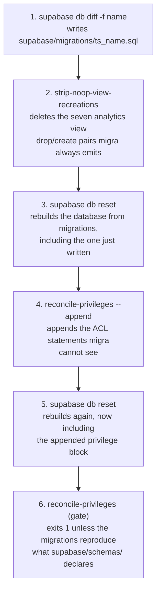

# Explaining a pipeline: a worked example

A walkthrough section covering a pipeline, a multi-pass algorithm, or a command
that chains several tools. Read
[`../SKILL.md`](../SKILL.md) section **Explaining a multi-step algorithm or
pipeline** for the rules; this file is one section written to them, followed by
an annotation naming which rule each part satisfies.

The subject is `pnpm db:new-migration` in the Avandar repository, a six-step
command that generates a Supabase migration and then makes it complete. It is
used here because it has the two properties that make a pipeline hard to
explain: the steps are only meaningful in order, and the reason it works is a
pair of guarantees that no single step produces on its own.

---

## The example

### 3.2 How db:new-migration produces a complete, non-repeating migration

`supabase db diff` is not a complete migration generator for this repository,
and `db:new-migration` wraps it in five further steps that close the gaps. Both
gaps were measured by putting one deliberate delta into `supabase/schemas/` and
reading what the diff emitted.

**The diff is incomplete in two known ways.** It proposes a drop and recreate
for all seven `analytics.*` views on every run, whether or not a view changed.
And it emits no column privileges, no schema privileges, no view grants, and no
`alter default privileges`, because migra does not diff those categories at
all. Steps 2 and 4 exist to close exactly those two gaps, and nothing in the
command is a general safety net for anything else.

*Both resets are steps, not housekeeping. Step 4 can only compute a delta
against a database built from migrations, and step 6 can only verify step 4 by
rebuilding after it.*

#### Step 1. `supabase db diff -f <name>`

migra builds a shadow database from `supabase/schemas/`, compares it to the
local database, and writes `supabase/migrations/<ts>_<name>.sql`. The stack is
stopped and restarted around it because `db diff` tears it down.

#### Step 2. `strip-noop-view-recreations`

For each `create or replace view` in the new migration, this creates a probe
view from the migration's body and compares `pg_get_viewdef()` of the probe
against `pg_get_viewdef()` of the live view, in one session. One session is
what makes the comparison meaningful: `pg_get_viewdef` renders schema
qualification from `search_path` at render time, so one parse tree prints
differently under different connection settings, and that difference is what
migra reads as a changed view.

Identical rendering means the statement would change nothing, so its `create`
and the matching `drop` are deleted from the file. The churn is generated on
every run and removed on every run, so it never reaches a committed migration.

#### Step 3. `supabase db reset`

Rebuilds the local database from `supabase/migrations/` alone, including the
migration just written. Without this, step 4 would compare against whatever
state the developer's session had accumulated, and would append statements for
privileges that earlier migrations already installed.

#### Step 4. `reconcile-privileges --append`

Takes two snapshots of the same database and diffs them.

| Snapshot | Produced by | Meaning |
| --- | --- | --- |
| `actual` | `getSnapshotSql(scope)`, run plainly | the ACLs the migrations-built database has |
| `declared` | `getReplaySql(...)`: `begin`, strip, replay every declaration, assert, `select`, `rollback` | the ACLs `supabase/schemas/` calls for |

`declared` is a measurement, not an artifact. The replay revokes and re-grants
against the real objects inside one transaction, reads the catalogs, and rolls
back; the rows reach stdout before the rollback, and nothing else survives it.

`reconcile` keys every entry on `(kind, object, column, grantee, privilege,
isGrantable)` and computes `surplus`, present in `actual` and not in
`declared`, and `missing`, the reverse. For every object named by either set it
emits one `revoke all` followed by one `grant` per declared grantee. The pair
is absolute rather than incremental, so it lands on the declared state whatever
the object held before. Those statements are appended to the newest migration
under a header telling the reader not to hand-edit them.

The step refuses to run outside this command. `--append` checks for
`AVANDAR_MIGRATION_PIPELINE=1` and exits 1 otherwise, because on its own it
skips the view strip that must precede it and the verification that must follow.

#### Step 5. `supabase db reset`

Rebuilds from migrations again, now including the appended privilege block.

#### Step 6. `reconcile-privileges` in gate mode

The same two snapshots and the same diff, without `--append`. `surplus` and
`missing` must both be empty. The gate also exits 1 on any function in a
managed schema that no schema file revokes, because such a function has
`proacl = NULL`, which Postgres reads as its built-in grant of EXECUTE to
`PUBLIC`.

### 3.2.1 Why a privilege is not re-appended on every later migration

The append is a delta against the applied migration set, not a dump of the
declarations, and step 3 is what makes that true. After the reset, `actual`
reflects every privilege statement any prior migration applied. So a grant
installed by migration 40 is present in `actual`, present in `declared`,
therefore in neither `surplus` nor `missing`, therefore its object is never
added to the affected set, therefore no statement is emitted for it.

A new migration receives a privilege block only for objects whose ACL actually
differs, which in practice means objects that migration created or altered. A
migration that changes no privileges appends nothing.

### 3.2.2 Why drift cannot reach a committed migration

Three mechanisms compose, and each closes a failure the other two do not.

**The strip makes the replay absolute.** Relations, columns and schemas are
declared with positive `grant` statements only. Replaying those onto an
already-granted database would be a union of no-ops, and a surplus grant would
be invisible. Revoking every managed privilege first means the post-replay ACL
is exactly what the declarations say. Functions and default privileges are
deliberately not stripped: their declarations already name every managed
grantee in a `revoke` before any `grant`, so replaying them reaches the
declared state from any starting point.

**The probe table asserts the baseline.** After the replay, the transaction
creates a throwaway table in each managed schema and raises if it arrived
carrying any privilege for `PUBLIC`, `anon`, `authenticated`, or
`service_role`. The replay's correctness rests on stripped meaning birth state,
and birth state rests on `00.default_privileges.sql`. If that declaration ever
stops taking effect, the command fails with a message naming the schema instead
of measuring against a permissive baseline and reporting a wrong answer.

**Step 6 re-asks the question after the fix.** The command does not trust its
own step 4. It rebuilds and re-verifies, so a migration that looks finished and
is not cannot leave the command with exit 0.

`pnpm test:db` runs step 6 on its own afterwards, which catches drift
introduced later by a merge rather than at authoring time.

---

## What the example does at each point

| Part | Rule it satisfies |
| --- | --- |
| The opening two paragraphs, before any step | The structural fact first. The reader's assumption is that `db diff` produces a finished migration; the section names that assumption and bounds the gaps precisely, so the five extra steps arrive already placed. |
| "measured by putting one deliberate delta into `supabase/schemas/`" | Evidence for a claim the reviewer would otherwise have to take on trust. |
| Step headings named `supabase db diff -f <name>`, `strip-noop-view-recreations` | Steps named by their trigger, so each can be grepped for. |
| Steps 3 and 5, each with a sentence on what breaks without it | Ordering constraints treated as content. Two steps that look like housekeeping are the reason two guarantees hold. |
| The `actual` and `declared` table | A two-column table for a step that compares two states, rather than prose alternating between them. |
| "Functions and default privileges are deliberately not stripped" | The exclusion stated, closing the question the strip step opens. |
| "`declared` is a measurement, not an artifact" | Corrects the model a reader arrives with, that a comparison target must be a built thing. |
| 3.2.1 and 3.2.2 as separate numbered subsections | One section per guarantee. Both are properties of the whole pipeline, and neither is visible from the step list. |
| The migration-40 trace in 3.2.1 | One traversal with real values, carried through every intermediate state to the output. |
| The diagram caption naming the two resets | The caption states what to notice, not what the drawing shows. |

Two things the example leaves out on purpose. It does not narrate the code line
by line, and it names no line numbers. It also does not explain what migra is
or how `pg_get_viewdef` works beyond the one property the argument depends on,
because a walkthrough is read by someone who can look up a Postgres function
and cannot look up this repository's reasons.
