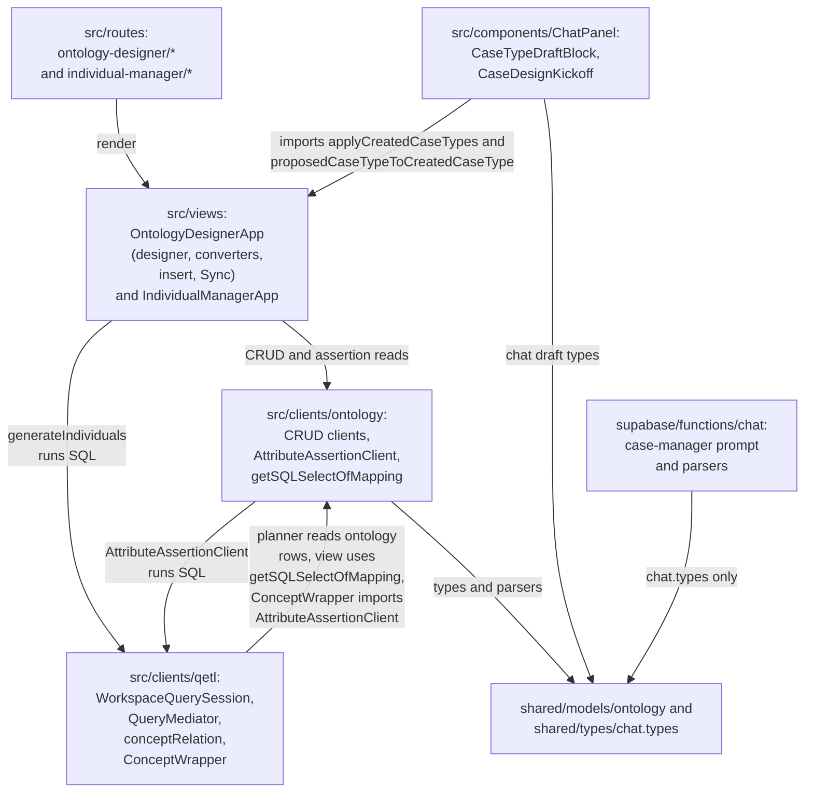
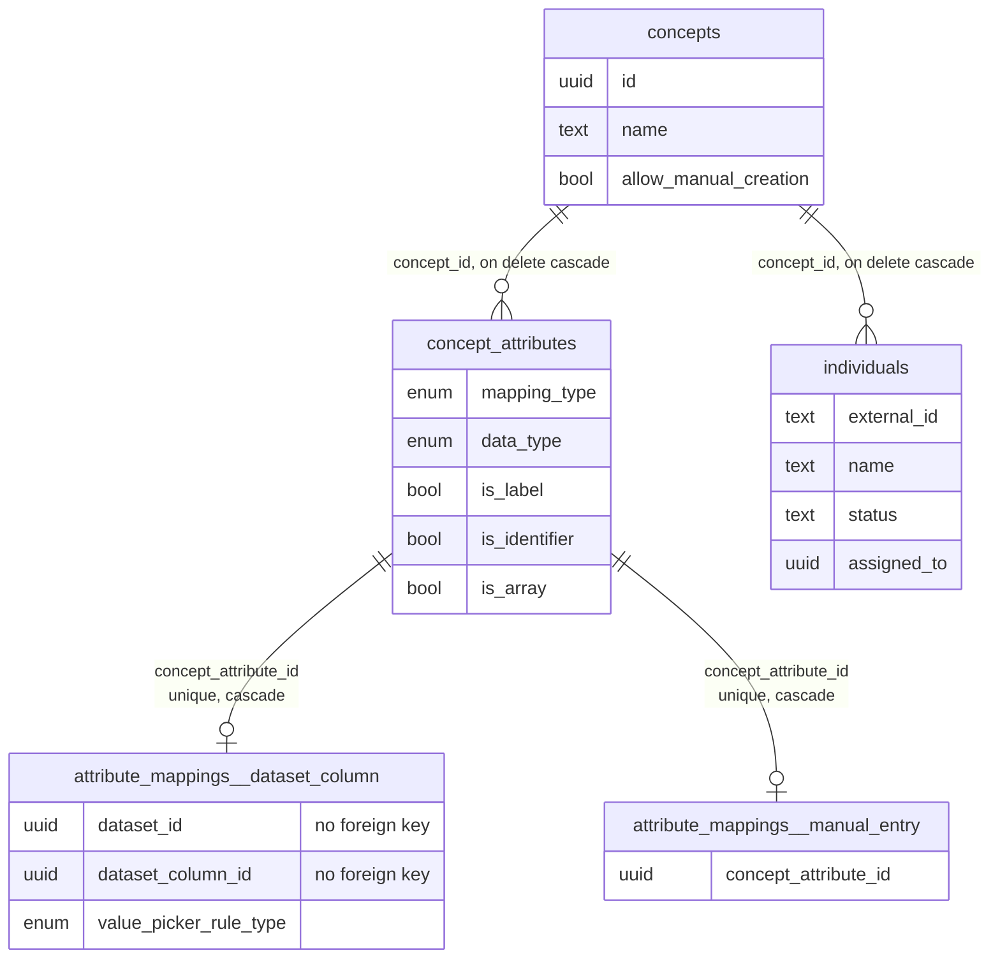
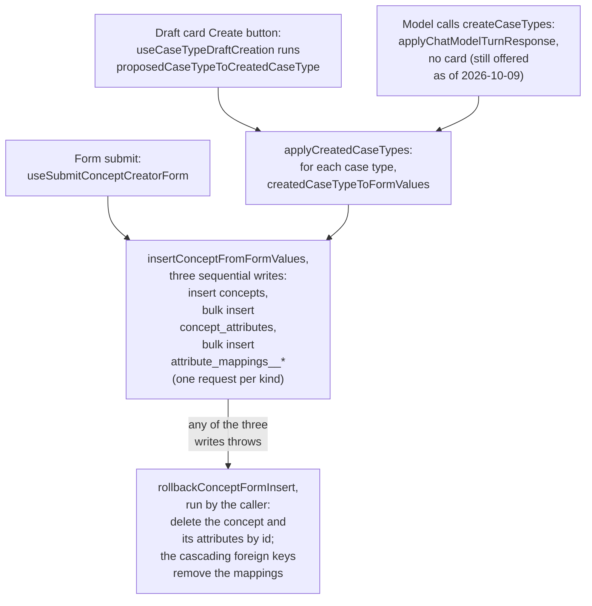
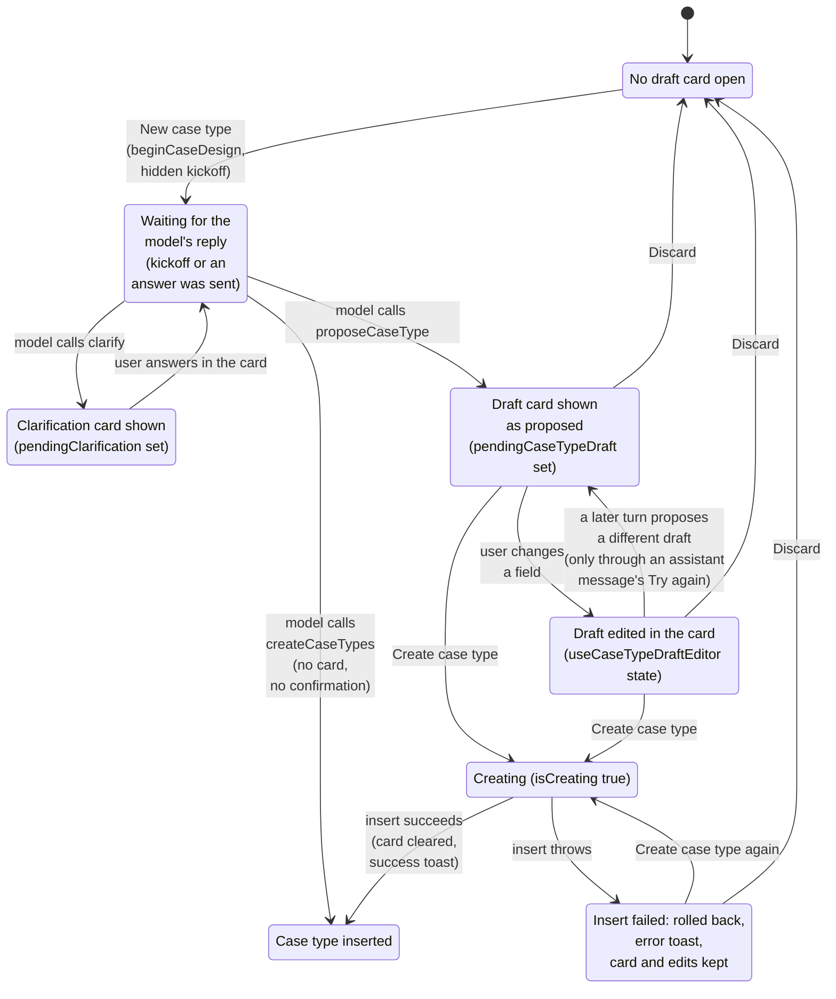
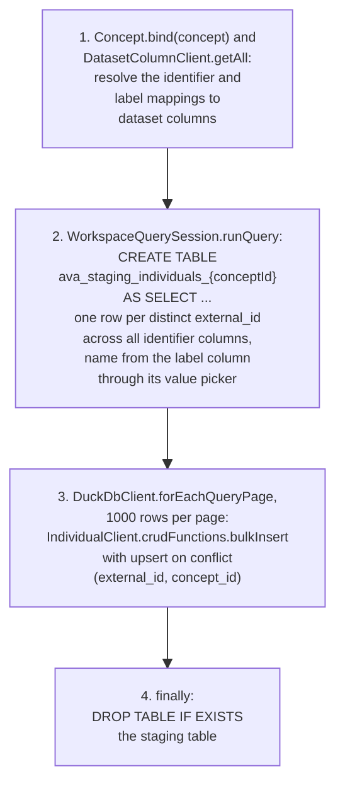
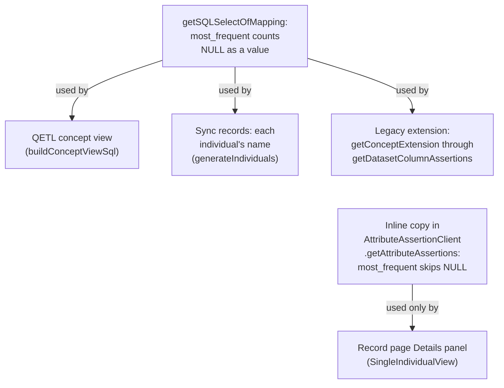
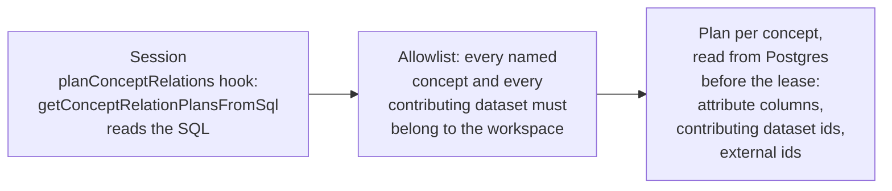
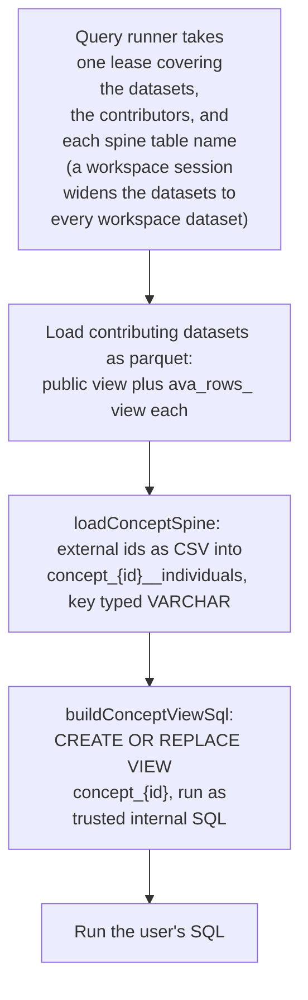
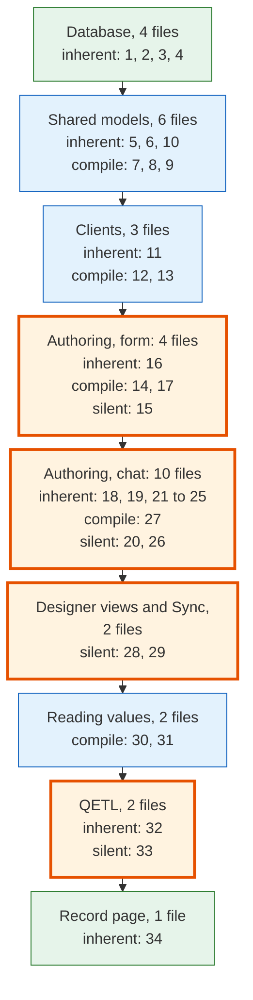
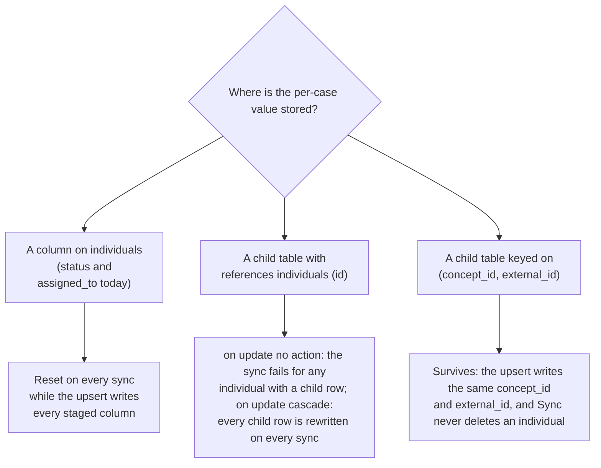

# Ontology architecture (case management)

How the ontology subsystem is built: the tables, the authoring paths, record
generation, value reading, the QETL bridge, and the UI. In the product it is
called **Case Manager**. Read this before changing anything under
`shared/models/ontology/`, `src/clients/ontology/`,
`src/views/OntologyDesignerApp/`, `src/views/IndividualManagerApp/`,
`src/components/ChatPanel/CaseTypeDraftBlock/`, or
`src/clients/qetl/QueryMediator/conceptRelation/`.

Terminology lives in [description-logic-nomenclature.md](description-logic-nomenclature.md).
The QETL engine this subsystem plugs into is described in
[qetl-architecture.md](qetl-architecture.md).

Behaviour marked **(as of 2026-10-09)** describes the code on that date and is
expected to change; everything else is the intended architecture.

## Contents

1. What the subsystem is
2. Terms
3. Code layout
4. Data model and row-level security
5. Authoring a case type
6. Generating records (Sync records)
7. Reading attribute values
8. Concepts as QETL relations
9. UI map
10. Invariants and rules
11. Design patterns and their caveats
12. How to add a new attribute source
13. How to add a per-case capability
14. How to add a dataset connector
15. Testing
16. Known limitations (as of 2026-10-09)
17. Roadmap and specs
18. References

## 1. What the subsystem is

A workspace imports datasets, and one real-world thing (a county, a patient) is
usually spread across several of them. A **case type** declares fields whose
values come from columns of those datasets; the app then shows one **record**
per real-world thing and lets SQL query the records like a table.

Internally this is Description Logic vocabulary [1]:

- The **TBox** (terminology) is the set of concepts, their attributes, and the
  mappings that say where each attribute's value comes from.
- The **ABox** (facts) is the individuals and their attribute values.

Two design facts:

- **Attribute values are never stored.** They are computed from the datasets
  every time they are read, which is the ontology-based data access (OBDA)
  reading of an ontology: a mapping defines an attribute as a query over the
  sources, and reading the ABox means evaluating those queries [2].
- **Individuals are stored.** Sync records materializes one `individuals` row
  per distinct dataset key, so concept membership (which keys belong to a case
  type) is persisted while attribute values stay virtual.

There is no reasoning: no subsumption between concepts and no roles
(relationships) between individuals. The TBox is a schema registry.

## 2. Terms

| Product term (UI) | Code term | Table | Model namespace |
| --- | --- | --- | --- |
| Case type | Concept | `concepts` | `Concept` |
| Field | Concept attribute | `concept_attributes` | `ConceptAttribute` |
| Where a field comes from | Attribute mapping | `attribute_mappings__dataset_column`, `attribute_mappings__manual_entry` | `AttributeMapping` |
| Record, case | Individual | `individuals` | `Individual` |
| A field's value on a record | Attribute assertion | none (computed) | `AttributeAssertion` |
| Record's display name | Label attribute (`is_label`) | `concept_attributes` | |
| Join key of a dataset | Identifier attribute (`is_identifier`) | `concept_attributes` | |
| The key value | `external_id` | `individuals` | |
| Case Manager | Ontology Designer | routes under `/ontology-designer` | `OntologyDesignerApp` |
| Records screen | Individual Manager | routes under `/individual-manager` | `IndividualManagerApp` |

User-facing copy says case type, field and record; identifiers use the DL
names. Do not put DL terms in UI strings.

## 3. Code layout

- **Tables, policies, triggers**: `supabase/schemas/10.concepts.sql`, `20.concept_attributes.sql`, `20.individuals.sql`, `30.attribute_mappings__dataset_column.sql`, `30.attribute_mappings__manual_entry.sql`
- **RLS tests**: `supabase/tests/database/permissions/rls_{concepts,concept_attributes,individuals,attribute_mappings__dataset_column,attribute_mappings__manual_entry}.test.sql`
- **Shared models and parsers**: `shared/models/ontology/`
- **CRUD clients and mapping dispatch**: `src/clients/ontology/`
- **Virtual assertions and value pickers**: `src/clients/ontology/AttributeAssertionClient/`
- **Concepts as QETL relations**: `src/clients/qetl/QueryMediator/conceptRelation/`, `src/clients/qetl/wrappers/ConceptWrapper/`
- **Case Manager (TBox authoring, Sync)**: `src/views/OntologyDesignerApp/`
- **Records screens (ABox browsing)**: `src/views/IndividualManagerApp/`
- **Chat draft card and session kickoff**: `src/components/ChatPanel/CaseTypeDraftBlock/`, `src/components/ChatPanel/CaseDesignKickoff/`
- **Chat edge function pieces**: `supabase/functions/chat/PostChatMessages/parsing/parseProposeCaseType.ts`, `parseCreateCaseTypes.ts`, `prompt/buildCaseManagerSystemPrompt.ts`
- **Chat contract types**: `shared/types/chat.types.ts` (`ChatProposedCaseType`, `ChatCreatedCaseType`)
- **Routes**: `src/routes/_auth/$workspaceSlug/ontology-designer/`, `src/routes/_auth/$workspaceSlug/individual-manager/`

Module dependencies:

_The two-way edge between the ontology clients and QETL is a module import
cycle; keep the cyclic imports out of module top-level code, or loading can
break, depending on which module in the cycle is evaluated first._

The cycle runs `AttributeAssertionClient` → `WorkspaceQuerySession` →
`QueryMediator` → `queryRunner` → `relationLoading` → `createDefaultRegistry` →
`ConceptWrapper` → `AttributeAssertionClient`. The chat component layer also
imports from the views layer (`useCaseTypeDraftCreation`).

## 4. Data model and row-level security

_Each attribute has exactly one mapping row, in the table its `mapping_type`
names. Every table also carries `workspace_id`, which the policies test._

| Table | One row means | Notes |
| --- | --- | --- |
| `concepts` | A case type | `allow_manual_creation` is stored; nothing reads it yet |
| `concept_attributes` | A field of a case type | `mapping_type` (`dataset_column`, `manual_entry`) discriminates which mapping table holds its mapping |
| `attribute_mappings__dataset_column` | "This field reads this column of this dataset, collapsed by this value picker" | `dataset_id` and `dataset_column_id` are bare ids, not foreign keys |
| `attribute_mappings__manual_entry` | "This field is typed by hand" | Holds no value; no table stores entered values yet |
| `individuals` | A record: one key of one case type | `unique (concept_id, external_id)`; `name` is `not null`; `status` and `assigned_to` are the only per-case state |

Attribute assertions have no table. The `AttributeAssertion` model's `id`,
`createdAt` and `updatedAt` are generated at read time and identify nothing;
`datasetId` is its only provenance field. (An `entity_field_values` table once
stored values; migration `20250929162612` dropped it.)

**RLS model.** Every policy on all five tables (four per table) uses one
predicate: `workspace_id = any(array(select util__get_auth_user_workspaces()))`.
Access is workspace membership only; the ontology is not part of the role-based
permission catalog in [permissions-architecture.md](permissions-architecture.md),
so any member can create, sync and delete case types. `anon` has no grant.

**(as of 2026-10-09)** The `UPDATE` policies on `concepts`,
`concept_attributes` and both mapping tables have `with check` but no `using`,
so an update by a member matches zero rows. Through the shared clients'
`update` (which uses `.select().single()`) that surfaces as PostgREST's
`PGRST116` no-rows error; through a plain update it reports success and changes
nothing. `individuals` has a `using` and updates normally. Add a `using` before
building any edit feature.

**Database-enforced integrity:**

- Concept delete cascades to attributes, mappings and individuals (all four
  foreign keys are `on delete cascade`).
- The trigger `concept_attributes__validate_label_and_identifiers`
  (`after insert or update` on `concept_attributes`) requires exactly one label
  attribute per concept.
- The same trigger also checks one identifier per contributing dataset, but
  **that half checks nothing on creation**: the insert path writes attributes
  before mappings, so the join to the mapping table is empty when it runs and
  the check passes vacuously. No trigger on the mapping tables re-checks it. See
  section 10 for where the rule is enforced instead.

## 5. Authoring a case type

Every creation, from any entry point, persists through one function,
`insertConceptFromFormValues`
(`src/views/OntologyDesignerApp/insertConceptFromFormValues/insertConceptFromFormValues.ts`).

Where:

- **`attribute_mappings__*`** - the per-kind mapping tables.

_Three entry points share one writer and one compensating delete, and the
delete runs in the browser, so a page closed mid-write leaves a partial
concept._

### 5.1 The shared insert: three writes and a compensating delete

- Three writes, in this order: `concepts`, `concept_attributes`, then the
  mappings (one PostgREST request per mapping kind present, run together).
  There is no transaction.
- On failure the caller runs `rollbackConceptFormInsert` (the form mutation's
  `onError`, or the `catch` in `applyCreatedCaseTypes`): a compensating delete
  of the concept and its attributes, relying on cascades for mappings.
- The parser registry (`makeParserRegistry`) strips each insert to the table's
  columns, which is why the whole form object can be passed to
  `ConceptClient.insert`.

### 5.2 Form path (concept creator)

`src/views/OntologyDesignerApp/ConceptCreatorView/`, route
`/ontology-designer/concept-creator`. Nothing in the Case Manager screens links
to it; it is reached from Spotlight or by URL.

- Form state (`conceptFormTypes.ts`) keeps **one attribute list per mapping
  kind** (`datasetColumnAttributes`, `manualEntryAttributes`) plus
  `sourceDatasets` (the join key chosen per dataset), and every attribute
  carries a draft of every mapping kind (`AttributeFormValues.mappings`; a type
  test enforces a key per kind).
- `transformValues` in `index.tsx` derives the identifier attributes from the
  join key choices, concatenates the per-kind lists into one `attributes`
  list, and flags the label.
- Manual-entry fields are hidden when `FeatureFlag.DisableManualData` is on.

### 5.3 Chat path (design session and draft card)

Both visible "New case type" controls call
`ChatPanelStateManager.beginCaseDesign`, which opens the chat aside in composer
mode, bumps `caseDesignSessionNonce`, and clears any pending draft. `ChatPanel`
reacts to the nonce with `startNewChat`, which appends a hidden kickoff message
(`CaseDesignKickoff`, `"[Begin case type design]"`) so the assistant speaks
first. Any `/ontology-designer` path maps to chat context `case-manager`
(`makeChatPageContextFromPathname`).

On the edge function (`PostChatMessages`, context `case-manager`):

- `buildCaseManagerSystemPrompt` replaces the unified prompt. It is built from
  catalog metadata only (dataset and column names, types and ids, existing case
  type names), never row values.
- Tools offered: `clarify`, `proposeCaseType`, `createCaseTypes`. The prompt
  tells the model to open with one clarification, then propose a fully
  prefilled draft (clarifying again only for a genuine ambiguity), and not to
  call `createCaseTypes`.
- `parseProposeCaseType` sanitizes the draft: it drops sources without a join
  key, attributes whose dataset is not a declared source, and a label that is
  not one of the attributes, and defaults unknown value pickers to
  `most_frequent`.

On the client, the draft becomes `pendingCaseTypeDraft` and
`CaseTypeDraftBlock` renders it. The session as a state machine:

_The composer is disabled in Case Manager (as of 2026-10-09), so every path
back to the model goes through a clarification card or an assistant message's
Try again button. New chat or New case type restarts from any state._

The draft card converts to the insert payload in two steps that do no I/O:

1. `proposedCaseTypeToCreatedCaseType` applies the user's edits: keeps checked
   attributes, re-includes every join key, drops sources left with no
   attribute, and falls back to the first join key as the label.
2. `createdCaseTypeToFormValues` (called by `applyCreatedCaseTypes`) resolves
   column ids against the workspace's `dataset_columns` (unknown ids are
   dropped), adds a missing identifier attribute for any source whose join key
   was not an attribute, and makes the first identifier the label when none is
   set.

## 6. Generating records (Sync records)

`generateIndividuals`
(`src/views/OntologyDesignerApp/ConceptMetaView/generateIndividuals/index.ts`),
triggered by **Sync records** on the case type detail page. It recomputes the
full set of individuals for one concept in browser DuckDB and upserts them. It
computes no attribute values.

_Each page is a separate PostgREST request, so a sync has no atomicity: a
failed page leaves the earlier pages written._

Design points:

- The staging table carries the `ava_staging_individuals_` prefix because a
  bare UUID in a DuckDB table name always means a dataset to
  `RelationRef.fromTableName`.
- `neededColumnsByDatasetId` names the columns read (each dataset's key column,
  plus the label column), so the mediator does not acquire whole datasets for a
  `CREATE TABLE AS`, which has no top-level select list to infer from.
- The label must be a `dataset_column` attribute; Sync reads no other kind.

**Current overwrite behaviour (as of 2026-10-09).** Each staged row carries a
fresh `gen_random_uuid()` id, `NOW()` timestamps, `status = 'active'` and
`assigned_to = NULL`, and the upsert (PostgREST `merge-duplicates`, nine
columns in the payload) updates every column it sends. So every sync:

- gives every existing individual a **new `id`** (open record URLs then hit
  TanStack Router's generic "Not Found"),
- **resets `status` and `assigned_to`**, and resets `created_at`,
- never deletes individuals whose keys left the data,
- fails a whole page (and stops) when a label resolves to NULL, because
  `individuals.name` is `not null`; this happens for keys that exist only in a
  dataset other than the label's, and for keys whose label cells are all NULL
  (or mostly NULL under `most_frequent`).

The fix direction: stage only `workspace_id`, `concept_id`, `external_id`,
`name` and `updated_at`, give `status` a column default, so the merge refreshes
names and new rows take defaults. See section 13.

## 7. Reading attribute values

Attribute values are computed per read. There are two implementations of the
value semantics:

- `getSQLSelectOfMapping`
  (`src/clients/ontology/AttributeAssertionClient/getAttributeAssertions/getSQLSelectOfMapping.ts`),
  shared by the QETL concept view, Sync's name, and the legacy extension.
- An inline copy in `AttributeAssertionClient.getAttributeAssertions`, used only
  by the record page.

Where:

- **Legacy extension** - `getConceptExtension`, the older whole-concept read
  path (section 7.3).

_Changing a value rule means changing both copies until the record page reads
the concept view; they already disagree on NULL under `most_frequent` (as of
2026-10-09)._

### 7.1 Value pickers

A dataset is usually finer-grained than the case type, so each dataset-column
mapping names one of seven rules (a Postgres enum,
`attribute_mappings__value_picker_rule_type`). Each renders as a correlated
scalar subquery over one dataset, filtered by the outer row's key.

| Rule | SQL shape | Determinism |
| --- | --- | --- |
| `first` | Reads the `ava_rows_<datasetId>` view, `ORDER BY file_row_number LIMIT 1` | Total order within a parquet file |
| `most_frequent` | `GROUP BY col ORDER BY COUNT(*) DESC, col LIMIT 1` | Ties broken by value |
| `sum`, `avg`, `count`, `max`, `min` | `CAST(<agg>(col) AS DOUBLE)` | Floating-point; see limitations for `max`/`min` |

In `getSQLSelectOfMapping`, key comparison is always
`CAST(outer.external_id AS VARCHAR) = CAST(dataset."<key>" AS VARCHAR)`
(`getEntityKeyComparisonSql` in `src/clients/DuckDbClient/duckDbSqlText.ts`),
because `external_id` is Postgres `text` and a dataset key is often `BIGINT`.
The record page's inline copy does not cast (section 7.2).

The rule names are hand-written in five places: the database enum,
`DatasetColumnMappings.ValuePickerTypes`, `ChatCaseValuePickerRuleType` in
`shared/types/chat.types.ts`, `VALUE_PICKER_RULE_TYPES` in
`parseProposeCaseType.ts`, and the tool's JSON schema in
`makeChatToolConfigFromOptions.ts`.

### 7.2 Record page read path

`AttributeAssertionClient.getAttributeAssertions` loads the individual, the
identifier attributes and all requested mappings, then runs one statement per
contributing dataset over `ava_rows_<datasetId>` filtered by the individual's
`external_id`, and merges the results by attribute id. Each attribute reads
exactly one dataset. **(as of 2026-10-09)** it throws for any manual-entry
mapping, splices `external_id` into SQL as an unescaped, uncast literal, and the
page renders any error as a Loader that never stops.

### 7.3 Concept extension (legacy)

`AttributeAssertionClient.getConceptExtension` returns every individual's
values but runs one statement per dataset and concatenates the results, so an
individual in two datasets comes back as two partial rows. It survives as the
`_runConceptQuery` fallback in
`src/clients/queries/runStructuredQuery/runStructuredQueryWithMetadata.ts`
(used when a structured query on a concept has no SQL) and behind
`ConceptWrapper.pushDown`, which nothing calls. New code should read the
concept view.

## 8. Concepts as QETL relations

Any SQL naming `concept_<id>` (written by `RelationRef.toTableName`) is answered
by a DuckDB view built inside that query's lease. Nothing is materialized or
cached, and no source wrapper is involved. QETL itself is described in
[qetl-architecture.md](qetl-architecture.md); the spec is
[2026-08-18-qetl-concept-relations-design.md](superpowers/specs/2026-08-18-qetl-concept-relations-design.md).

Where:

- **lease** - an exclusive, per-name hold on DuckDB tables; work on the same
  names runs one at a time.

_Planning reads only the SQL text and Postgres, and finishes before the query
runner takes the lease._

_The view must be created last: DuckDB binds a view's sources when the view is
defined, so the datasets and the spine must already exist._

| Piece | File | What it guarantees |
| --- | --- | --- |
| Planning | `conceptRelation/getConceptRelationPlansFromSql/getConceptRelationPlansFromSql.ts` | No Postgres read for SQL that names no concept; foreign concepts and contributors throw (fail closed) |
| Column resolution | `conceptRelation/makeConceptAttributeColumnsFromMetadata.ts` | One column per attribute; one key column per dataset; duplicate names suffixed `_2`, `_3`; manual-entry and unmapped attributes become typed NULL columns; a missing dataset column or key column throws |
| Spine | `conceptRelation/loadConceptSpine/loadConceptSpine.ts`, `conceptRelation/toCsvColumn.ts` | Keys travel as RFC 4180 CSV, never spliced into SQL; key pinned to `VARCHAR`; empty `external_id` refused; empty concept gets an empty typed table |
| View | `conceptRelation/buildConceptViewSql.ts` | `FROM` is the spine alone, every attribute a correlated subquery, so the grain is one row per individual and a missing contribution is NULL; columns sorted by name for byte-stable SQL; array attributes as `list(... ORDER BY file_row_number)` |
| Ordering and lease | `src/clients/qetl/QueryMediator/queryRunner.ts`, `conceptRelation/loadConceptRelations.ts` | Datasets, then spine, then view, then user SQL; spine names included in the lease |

**Naming.** `concept_<id>` is the view; `concept_<id>__individuals` is the
spine and deliberately does not resolve as a relation. Chat SQL uses short
aliases (`c0`, `c1`) that `SqlTableAlias` rewrites to `"concept_<uuid>"` on the
edge function; see
[2026-08-19-chat-concept-aliases-design.md](superpowers/specs/2026-08-19-chat-concept-aliases-design.md).
Structured queries reach the view through `structuredQueryToSql`, which emits
`concept_<id>` for a concept data source.

**ConceptWrapper.** `src/clients/qetl/wrappers/ConceptWrapper/` is registered
in `createDefaultRegistry` but the registry is only resolved for dataset refs,
so it is not on any live path. Its `pushDown` delegates to the legacy
extension.

## 9. UI map

| Route (under `src/routes/_auth/$workspaceSlug/`) | Renders | Key files |
| --- | --- | --- |
| `ontology-designer/route.tsx` | Case Manager slate; list pane on detail routes | `src/views/OntologyDesignerApp/index.tsx`, `ConceptNavbar.tsx`, `NewCaseTypeButton.tsx` |
| `ontology-designer/index.tsx` | Home grid of case types, delete with confirm | `src/views/OntologyDesignerApp/CaseTypeHome/` |
| `ontology-designer/$conceptId.tsx` | Case type detail: attributes, View records, Sync records, Delete (read-only, no edit) | `src/views/OntologyDesignerApp/ConceptMetaView/` (`CaseTypeActions.tsx`, `CaseTypeAttributesList.tsx`, `useHydratedConcept.ts`) |
| `ontology-designer/concept-creator.tsx` | Concept creator form | `src/views/OntologyDesignerApp/ConceptCreatorView/` |
| `individual-manager/index.tsx` | Redirect to Case Manager home | |
| `individual-manager/$conceptId/route.tsx` | Records slate: list pane plus outlet | `src/views/IndividualManagerApp/index.tsx`, `IndividualNavbar.tsx`, `useConceptIndividuals.ts`, `useVirtualIndividualLinks.ts`, `EditCaseTypeButton.tsx` |
| `individual-manager/$conceptId/index.tsx` | Select-a-record or sync-first empty state | `src/views/IndividualManagerApp/IndividualSelectionEmptyState/` |
| `individual-manager/$conceptId/$individualId.tsx` | Record page: Details and Notes | `src/views/IndividualManagerApp/SingleIndividualView/` (`RecordAttributesList.tsx`, `ActivityBlock.tsx`) |

Outside the routes:

- **Chat draft card**: `src/components/ChatPanel/CaseTypeDraftBlock/`, rendered
  by `ChatThread` when `pendingCaseTypeDraft` is set.
- **Sidebar**: `WorkspaceLayout` adds one link per case type to its records
  screen.
- **Spotlight**: `SpotlightLinks.ontologyDesignerCreatorView` opens the form.
- Within this subsystem, chat runs only on `/ontology-designer` paths (context
  `case-manager`, where the composer is disabled as of 2026-10-09); records
  screens get chat context `other`, where chat is off.

## 10. Invariants and rules

| Rule | Enforced by | Notes |
| --- | --- | --- |
| One individual per `(concept_id, external_id)` | `individuals__concept_external_id_unique` in `supabase/schemas/20.individuals.sql` | The Sync upsert's conflict target and the source of the view's grain |
| Exactly one label attribute per concept | Trigger `concept_attributes__validate_label_and_identifiers`, `supabase/schemas/20.concept_attributes.sql` | `after insert`, so the bulk attribute insert is counted as a whole |
| One identifier attribute per contributing dataset | Not the database (see section 4). `createdCaseTypeToFormValues` (chat), form validation (`primaryKeyColumnId: isNotEmpty`), and a query-time throw in `makeConceptAttributeColumnsFromMetadata` | Any new authoring path must enforce it itself |
| At most one mapping row per attribute in each mapping table | `unique` on `concept_attribute_id` in both mapping tables | Nothing requires a row to exist (a partial write can leave none), and nothing checks that the row's table matches `mapping_type`; `_mappingsFromAttributes` keeps them consistent |
| TBox writes go concept, attributes, mappings | `insertConceptFromFormValues.ts` | The label trigger relies on attributes arriving in one statement |
| Every policy tests workspace membership | Policies in the five schema files; pgTAP files in `supabase/tests/database/permissions/` | Keep the predicate identical when adding a table |
| Concept delete removes its whole subtree | `on delete cascade` foreign keys | Individuals included |
| A bare UUID DuckDB table name means a dataset | `RelationRef.fromTableName` (`shared/models/relations/RelationRef/`) | Hence `concept_`, `ava_rows_`, `ava_staging_individuals_` prefixes and the `__individuals` suffix (`src/clients/DuckDbClient/duckDbSqlText.ts`, `loadConceptSpine.ts`) |
| Keys are compared as text | `getEntityKeyComparisonSql`, `duckDbSqlText.ts` | Applies to the view and Sync; the record page does not yet follow it |
| No user data spliced into concept SQL | `loadConceptSpine` loads keys as CSV through `toCsvColumn` | The record page does not yet follow it |
| `first` and arrays order by `file_row_number` | `getSQLSelectOfMapping`, `buildConceptViewSql`; the `ava_rows_` view is created by `src/clients/DuckDbClient/duckDbParquetLoad.ts` | Never use `row_number() OVER ()`; parallel scan order is unstable |
| Concept refs and contributors outside the workspace throw | `getConceptRelationPlansFromSql` | Do not change this to dropping the reference: a stale view could answer |
| Datasets and the spine before the view | `queryRunner._runLeasedQuery`, `loadConceptRelations` | DuckDB binds a view's sources when it is defined; the code loads datasets, then the spine, then the view. The lease must include each spine name (`_getLeaseNames`) |
| Chat prompt sees catalog metadata only | `buildCaseManagerSystemPrompt` | Never add row values |
| Every draft attribute names a declared source with a join key | `parseProposeCaseType`, `parseCreateCaseTypes`, `useCaseTypeDraftEditor` | Otherwise column resolution throws at query time |

## 11. Design patterns and their caveats

| Pattern | Where | Caveat |
| --- | --- | --- |
| Description Logic TBox/ABox split [1] | Tables, models, clients, apps | No reasoning: no subsumption, no roles |
| OBDA with global-as-view mappings [2], [3] | Mappings, `getSQLSelectOfMapping`, `buildConceptViewSql` | Concept membership is materialized; the unfolding exists twice |
| Mediator with wrappers | `QueryMediator`; `ConceptWrapper` | Concepts use a planner hook, not the wrapper; the wrapper is unused |
| Table Data Gateway plus Data Mapper | `createRdbCrudClient`, `makeParserRegistry` | `AttributeAssertionClient` is named a client but has no table |
| Tagged union with exhaustive `match` | Five `match(mappingType)` sites | No runtime registry of per-kind behaviour; `AttributeMappingModelRegistry` is a type only |
| Adapter chain onto one writer | `proposedCaseTypeToCreatedCaseType`, `createdCaseTypeToFormValues` | The chat path fabricates form-only fields |
| Compensating action | `rollbackConceptFormInsert` | Client-side, best effort |
| Staging table then merge | `generateIndividuals` | The merge overwrites every column and never deletes (as of 2026-10-09) |
| Fail-safe defaults | Concept allowlist, column resolution, spine loader | The record page swallows its errors; a `dataset_column` attribute with no mapping row becomes a typed NULL column rather than a throw |
| Injected reads around a pure core | `ConceptWrapperDependencies`, `ConceptRelationAllowlist`, `makeConceptAttributeColumnsFromMetadata` | Older code calls singleton clients directly and is harder to test |
| Reducer stores | `ChatPanelStateManager`, `ConceptCreatorStore` | `ConceptCreatorStore` holds only derived strings |

## 12. How to add a new attribute source

A new mapping kind is for values that are not rows of a dataset (for example a
`computed` field derived from other attributes of the same individual). A value
that comes from an external system should be a **dataset connector** plus a
`dataset_column` mapping instead, which needs no ontology change
(section 14).

The checklist below is for a `computed` kind, as of 2026-10-09. **Compile**
means TypeScript lists the site once the database enum gains the value;
**silent** means nothing fails until a user hits it.

| # | File | Change | Caught by |
| --- | --- | --- | --- |
| 1 | `supabase/schemas/20.concept_attributes.sql` | Add the enum value; decide label and identifier eligibility (the trigger only consults dataset mappings) | Inherent |
| 2 | New `supabase/schemas/30.attribute_mappings__computed.sql` | Table (`concept_attribute_id unique references concept_attributes on delete cascade`, `workspace_id`, config), four policies with a `using` on `UPDATE`, `updated_at` trigger, index | Inherent |
| 3 | New `supabase/tests/database/permissions/rls_attribute_mappings__computed.test.sql` | Cross-tenant tests, plus an insider update | Inherent |
| 4 | `apps/desktop/sync/syncable-tables.ts` | List the table in `ACTIVE_TABLES` or `EXCLUDED_TABLES` (the SQLite generator errors otherwise) | Inherent |
| 5, 6 | New `shared/models/ontology/AttributeMapping/ComputedMapping/ComputedMapping.types.ts` and `ComputedMappingParsers.ts` | Model and parsers | Inherent |
| 7 | `shared/models/ontology/AttributeMapping/AttributeMapping.types.ts` | `AttributeMappingModelRegistry` key | Compile |
| 8 | `shared/models/ontology/ConceptAttribute/ConceptAttributeParsers.ts` | Hard-coded `z.enum` | Compile (zod type test) |
| 9 | `shared/models/ontology/ConceptAttribute/ConceptAttributes.ts` | Metadata entry (no readers) | Compile |
| 10 | `shared/models/ontology/AttributeAssertion/AttributeAssertion.types.ts` | Provenance beyond `datasetId`, if shown | Inherent |
| 11 | New `src/clients/ontology/ComputedMappingClient.ts` | `createRdbCrudClient` call | Inherent |
| 12 | `src/clients/ontology/AttributeMappingClient.ts` | `bulkInsert` arm | Compile |
| 13 | `src/clients/ontology/ConceptAttributeClient.ts` | `getAllAttributeMappings` arm | Compile |
| 14 | `src/views/OntologyDesignerApp/ConceptCreatorView/conceptFormTypes.ts` | `mappings.computed` draft in both factories | Compile |
| 15 | `src/views/OntologyDesignerApp/ConceptCreatorView/index.tsx` | Per-kind list, its block, and the `.concat` in `transformValues` | **Silent** (a missing `.concat` drops the attributes) |
| 16 | New `ConceptCreatorView/ComputedAttributesBlock.tsx` | Form block | Inherent |
| 17 | `src/views/OntologyDesignerApp/insertConceptFromFormValues/insertConceptFromFormValues.ts` | `_mappingsFromAttributes` arm | Compile |
| 18 | `shared/types/chat.types.ts` | `ChatCreatedCaseAttribute` arm, proposal list | Inherent |
| 19 | `supabase/functions/chat/PostChatMessages/parsing/parseProposeCaseType.ts` | Parse the list | Inherent |
| 20 | `supabase/functions/chat/PostChatMessages/parsing/parseCreateCaseTypes.ts` | `kind` branch | **Silent** (unknown kinds dropped) |
| 21 | `supabase/functions/chat/PostChatMessages/prompt/makeChatToolConfigFromOptions.ts` | Both tool schemas | Inherent |
| 22 | `supabase/functions/chat/PostChatMessages/prompt/buildCaseManagerSystemPrompt.ts` | When to propose it | Inherent |
| 23, 24, 25 | `src/components/ChatPanel/CaseTypeDraftBlock/useCaseTypeDraftEditor.ts`, `CaseTypeDraftCard.tsx`, new section component | Draft card editing | Inherent |
| 26 | `src/views/OntologyDesignerApp/proposedCaseTypeToCreatedCaseType/proposedCaseTypeToCreatedCaseType.ts` | Carry the list | **Silent** |
| 27 | `src/views/OntologyDesignerApp/createdCaseTypeToFormValues/createdCaseTypeToFormValues.ts` | Kind branch and `_makeMappedAttribute` draft | Compile |
| 28 | `src/views/OntologyDesignerApp/ConceptMetaView/CaseTypeAttributesList.tsx` | Badge ternary labels every non-dataset kind "Entered manually" | **Silent** |
| 29 | `src/views/OntologyDesignerApp/ConceptMetaView/generateIndividuals/index.ts` | Only if the kind may be the label | **Silent** (crash) |
| 30 | `src/clients/ontology/AttributeAssertionClient/AttributeAssertionClient.ts` | Record page arm | Compile |
| 31 | `src/clients/ontology/AttributeAssertionClient/getAttributeAssertions/getAttributeAssertions.ts` | Legacy extension arm | Compile |
| 32 | `src/clients/qetl/QueryMediator/conceptRelation/buildConceptViewSql.ts` | Column kind and selector; a computed column needs an outer `SELECT`, since DuckDB cannot reuse an alias whose expression is a subquery | Inherent |
| 33 | `src/clients/qetl/QueryMediator/conceptRelation/makeConceptAttributeColumnsFromMetadata.ts` | Otherwise the kind becomes a typed NULL column | **Silent** |
| 34 | `src/views/IndividualManagerApp/SingleIndividualView/index.tsx` | Provenance display, if wanted | Inherent |

Generated afterwards: the migration (`pnpm db:new-migration`, after the
Supabase switch checks in `CLAUDE.md`), `shared/types/database.types.ts`, and
`apps/desktop/migrations/*.gen.sql`. No change is needed in `ConceptWrapper`,
the routes, `useHydratedConcept`, `getConceptRelationPlansFromSql` or
`getNeededColumnsFromQuery`.

Where:

- **Numbers** - rows of the table above; arrows follow its order.
- **Green** - only inherent edits; **blue** - incidental edits, all caught by
  the compiler; **orange, thick border** - at least one silent edit.

_34 files: 18 inherent, 10 compile-enforced, 6 silent. Search for the silent
sites by name before declaring a new kind done._

Why it is scattered, and what would consolidate it:

- Per-kind behaviour is a `match` repeated at each call site; a runtime
  registry (client, record reader, view-column builder, form block) per kind
  would collapse items 7, 8, 9, 12, 13, 17, 28 and 33.
- Values are read by two implementations plus a legacy one; moving the record
  page onto the concept view removes items 30 and 31.
- Form state and the chat contract keep one list per kind; a single attribute
  list with a discriminated mapping removes items 14, 15, 26 and 27.

## 13. How to add a per-case capability

Status workflows, comments, assignment and manually entered values are state
written by users, keyed to an individual, and not derived from datasets. Where
that state lives decides whether Sync erases it:

_Under the merge of 2026-10-09 only the natural-key placement keeps its data
without side effects: a column on `individuals` is reset, and an `id`-keyed
child table either blocks the sync (`no action`) or has every row rewritten on
every sync (`cascade`). Verified on 2026-10-09 by replaying the sync upsert
against all three placements in a rolled-back transaction on the local stack.
Once Sync stops sending `id`, `status` and `assigned_to`, all three placements
work._

Layers a per-case capability touches:

1. **Sync first.** Narrow the upsert (section 6) or key the new table on
   `(concept_id, external_id)`.
2. **Schema**: the new table(s) with membership policies (with a `using` on
   `UPDATE`), pgTAP tests, and `syncable-tables.ts`.
3. **Models and clients** for the new tables.
4. **Record page**: controls in `SingleIndividualView`; `ActivityBlock` is the
   existing (unwired) notes editor.
5. **A list or grid view** to filter by the new state; the records list pane has
   no ordering, filtering or search.
6. **QETL**, if SQL and dashboards should see the state: the spine carries only
   `external_id` (`ConceptRelationPlan.externalIds`, one CSV column), so the
   plan type, CSV writer and view select list must widen.
7. **Chat**, if case types should propose the capability (for example status
   sets): types, parser, tool schema, prompt, draft card.
8. **Permissions**: policies test membership only, so any member can change any
   case. Assignment needs a principal model (see
   [permissions-architecture.md](permissions-architecture.md)).

## 14. How to add a dataset connector

No ontology change is needed. Ontology SQL names only two relations per
dataset, its public view `"<datasetId>"` and `ava_rows_<datasetId>`, and both
are created by `DuckDbClient.loadParquet` for every relation the mediator loads.
Every source wrapper returns a parquet blob (`AcquiredRelation.parquetBlob`),
and the dataset wrapper's own rule in `createDefaultRegistry.ts` is that a new
source type is "an entry in this match plus a wrapper". Two conditions, both
needed by the Data Explorer anyway: `dataset_columns.name` must equal the parquet
column names, because ontology SQL quotes `datasetColumn.name`; and keys may be
of any type for the concept view, which compares them as text, while the record
page compares without casts (section 16).

## 15. Testing

Follow [rules/testing.md](rules/testing.md). Existing coverage:

| Layer | Files | Run with |
| --- | --- | --- |
| RLS (pgTAP) | `supabase/tests/database/permissions/rls_concepts.test.sql` and the four peers | `pnpm test:db`, only after `ava supabase status` reads green for the current branch (on any branch other than `develop`, that means its own switched project; see `CLAUDE.md`) |
| Concept view and column resolution against real DuckDB | `src/lib/sql/__tests__/buildConceptViewSql.executed.test.ts`, `conceptAttributeColumns.executed.test.ts`, `toCsvColumn.executed.test.ts` | `pnpm vitest run --config vitest.executed.config.ts <files>` (or `pnpm test:executed`) |
| QETL planning, spine, ordering | `src/clients/qetl/QueryMediator/conceptRelation/**/*.test.ts`, `src/clients/qetl/QueryMediator/__tests__/QueryMediator.concepts.test.ts`, `src/clients/qetl/wrappers/ConceptWrapper/ConceptWrapper.test.ts` | `pnpm vitest run <paths>` |
| Authoring conversion and draft card | `src/views/OntologyDesignerApp/**/*.test.ts(x)`, `src/components/ChatPanel/CaseTypeDraftBlock/*.test.ts(x)`, `src/components/ChatPanel/CaseDesignKickoff/CaseDesignKickoff.test.ts` | `pnpm vitest run <paths>` |
| Edge function parsing and prompt | `supabase/functions/chat/PostChatMessages/parsing/parseProposeCaseType.test.ts`, `parseCreateCaseTypes.test.ts`, `prompt/buildCaseManagerSystemPrompt.test.ts` | `pnpm vitest run <paths>` |
| Records UI | `src/views/IndividualManagerApp/**/*.test.tsx` | `pnpm vitest run <paths>` |

Gaps to close when touching the code: no test covers
`AttributeAssertionClient`, `insertConceptFromFormValues`, or Sync's upsert
semantics (its tests assert the staging SQL text), and no pgTAP case checks
that a workspace member can update a row. Value-picker tests must construct
ties, since a rule deterministic only without ties is not deterministic.

## 16. Known limitations (as of 2026-10-09)

Verified means reproduced (database, DuckDB CLI, or the running app); read
means established from the code.

| Limitation | Effect | Status |
| --- | --- | --- |
| Sync upserts every staged column, including a fresh `id`, `status` and `assigned_to` | Record URLs break and case state is erased on every sync | Verified (`pg_stat_statements` and a rolled-back replay) |
| Sync takes keys from every dataset but the name from one | A multi-dataset case type with an uncovered key fails to sync, after partial writes | Read |
| Record page throws on any manual-entry mapping; chat offers manual fields regardless of `DisableManualData` | The Details panel never loads for such case types | Verified (app) |
| `max`/`min` cast to `DOUBLE`, which fails for non-numeric columns | Date or text attributes with those rules fail their record pages and any concept query that reads the column; numeric columns are unaffected | Verified (DuckDB CLI 1.3.2; the app's DuckDB-wasm build not tested) |
| Record page splices `external_id` unescaped and uncast | A key with a quote, or a text key against a numeric key column, fails the record page | Verified (DuckDB CLI) |
| Sync never deletes individuals | Records whose keys left the data stay | Read |
| `getPage` in `createSupabaseCrudClient` uses an inclusive range with no order | Duplicate rows in the records list; duplicate spine keys past 500 individuals | Verified (duplicate-key warnings; rolled-back replay) |
| Two `most_frequent` copies disagree on NULL | Record page and queries can show different values | Verified (DuckDB CLI) |
| `UPDATE` policies without `using` on four tables | Any edit feature fails with `PGRST116` or silently changes nothing | Verified (rolled-back update) |
| Identifier-per-dataset trigger check runs before mappings exist | The database never enforces one key per dataset | Read |
| No foreign key from mappings to datasets or columns | Deleting a dataset breaks every concept that reads it | Read |
| `createCaseTypes` still offered to the model | A call creates case types with no confirmation and default pickers | Read |
| Composer disabled in Case Manager | The prompt's "revise the draft" turn is unreachable, and a kickoff that fails (shown with no error, a separate gap) can be retried only through New chat or New case type | Verified (app) |
| Draft card join key options are the proposed attributes only | A key column the model did not list cannot be chosen | Read |
| The form allows a manual-entry label | Sync then fails with a TypeError | Read |
| Value-picker SQL quotes names without escaping | A name containing `"` breaks the concept view | Read |

Not built: roles between concepts, subsumption, status sets, comments,
assignment, activity log, manual entry storage, editing a case type, manual
creation of individuals, a records grid with filters, incremental sync,
concepts on public dashboards (`PublicQuerySession` has no concept planner),
and the auto-limit guard for large concepts.

## 17. Roadmap and specs

- [production-plan-world-humanitarian-day.md](production-plan-world-humanitarian-day.md):
  P2 (cross-product query fabric, the ABox as a queryable source), P3.2
  (sharing for ontology and case resources), P5 (Ontology Designer: roles,
  subsumption, manual entry, incremental generation), P5b (configurable TBox,
  status sets), P5c (case management product: comments, assignment, status
  workflow, list view). Its note that concept delete does not cascade is out of
  date; the schema cascades.
- [superpowers/specs/2026-08-18-qetl-concept-relations-design.md](superpowers/specs/2026-08-18-qetl-concept-relations-design.md):
  the concept view, spine, determinism rules, and the planned consolidation of
  the record page and removal of `_runConceptQuery`.
- [superpowers/specs/2026-08-19-chat-concept-aliases-design.md](superpowers/specs/2026-08-19-chat-concept-aliases-design.md):
  `cN` aliases in chat SQL.
- [description-logic-nomenclature.md](description-logic-nomenclature.md): the
  vocabulary and the rename history.

## 18. References

[1] F. Baader, D. Calvanese, D. L. McGuinness, D. Nardi, and P. F.
    Patel-Schneider, Eds., *The Description Logic Handbook: Theory,
    Implementation, and Applications*. Cambridge, U.K.: Cambridge Univ. Press,
    2003.

[2] A. Poggi, D. Lembo, D. Calvanese, G. De Giacomo, M. Lenzerini, and
    R. Rosati, "Linking data to ontologies," *J. Data Semantics X*, LNCS 4900,
    pp. 133-173, 2008. https://doi.org/10.1007/978-3-540-77688-8_5

[3] M. Lenzerini, "Data integration: a theoretical perspective," in *Proc. 21st
    ACM SIGMOD-SIGACT-SIGART Symp. Principles of Database Systems (PODS)*, 2002,
    pp. 233-246. https://doi.org/10.1145/543613.543644
