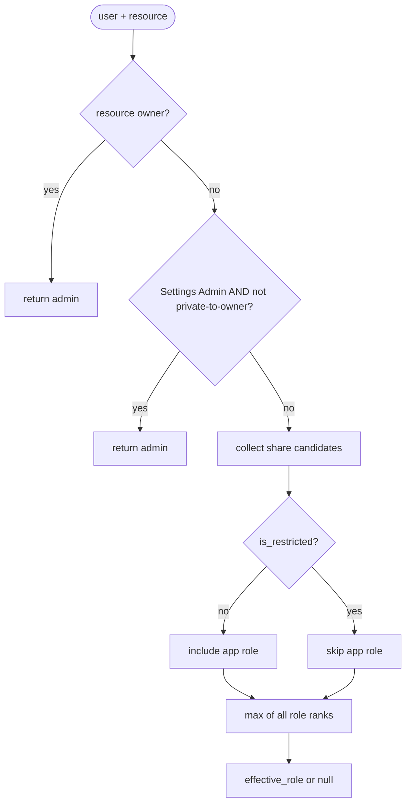
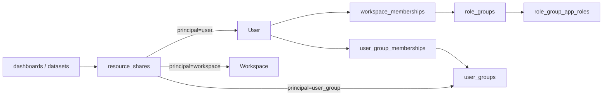
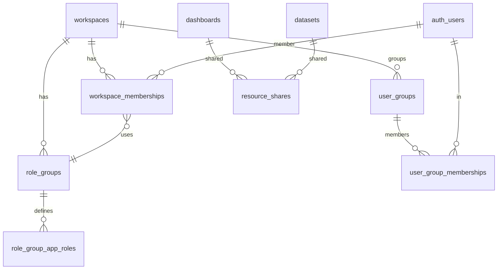

# Permissions architecture

This document is the canonical description of Avandar’s granular workspace
permissions model (per-app roles, role groups, user groups, resource shares,
and restriction). Humans and agents should treat it as the source of truth;
when implementation diverges, update the code **or** this file in the same PR.

**Related legacy state:** today production uses `public.user_roles.role` with
values `admin` | `member`. The migration below maps that to the new tables
without changing product semantics until RLS cut-over (later phase).

---

## 1. Goals

The system replaces a single workspace membership role with **per-application**
capabilities (`admin`, `editor`, `viewer`) across four apps, adds **role
groups** as named presets whose matrix lives in `role_group_app_roles` and is
joined through `workspace_memberships.role_group_id`, adds **user
groups** so people can be labeled and used as share principals, and adds
**per-resource shares** (user, user group, or whole workspace) at a chosen
role level. User-group shares may set a `requires_app_access` flag so the
share only applies to members who also hold any role on the resource’s parent
app. Resources may be marked **restricted**, which turns off the workspace-wide
default (the user’s app role) so only explicit shares (plus super-user paths)
grant access. **Workspace owners** and **Settings Admins** remain unconditional
admins for enforcement shortcuts. The experience is intentionally similar to
Google Drive-style sharing layered on top of workspace membership.

---

## 2. Vocabulary

**App (`app_type`)** - A product surface within a workspace whose access is
granted independently. v1 values: `data_sources`, `data_explorer`,
`dashboards`, `settings`. Example: a user can be `editor` in `dashboards` and
`viewer` in `data_sources`.

**Role level (`role_level`)** - One of `viewer` < `editor` < `admin`. Ordered
low→high in Postgres so enum comparison matches intent. Example: `editor` can
edit content that `viewer` can only read, per permission catalog rules.

**Permission key** - A derived string such as `data_sources__can_edit_dataset`;
the catalog maps `(app, role_level)` → keys. Admins do not toggle individual
keys; SQL enforces role levels, TypeScript gates UI via the catalog.

**Role group** - A named bundle of per-app role levels (`role_groups` +
`role_group_app_roles`). Built-ins include Global Admin / Editor / Viewer;
workspace admins may create custom groups. Example: “Analyst” =
`data_explorer: editor`, `dashboards: viewer`, others unset or defaulted per
product rules.

**User group** - A workspace-scoped label (`user_groups`) with memberships
(`user_group_memberships`). User groups are used as **principals** on
`resource_shares` (see Share below). Example: a “Health” group with the Health
team’s users, granted `editor` on a Health dataset via a share row.

**Resource** - A row protected by RLS, typed as `resource_type` (`dashboard` |
`dataset` in v1). Carries optional share rows; may set `is_restricted`.

**Share** - A row in `resource_shares` granting a **principal** (single user,
user group, or entire workspace) a **role level** on one resource. Example:
share dashboard D to user U at `viewer`. User-group shares may set
`requires_app_access = true` to apply the share only to members who already
have **any** role on the resource’s parent app.

**Restriction (`is_restricted`)** - When `true` on a dashboard or dataset,
the workspace-wide default (applying the user’s normal app role to every
resource of that app) does **not** grant access; explicit shares (and owner /
Settings Admin paths) still do.

**Private to owner** - A resource with `is_restricted = true` and no
`resource_shares` row whose principal is anyone other than the owner. Readable
by its owner alone: not by Settings Admins, not by the workspace owner.
Computed by `util__is_resource_private_to_owner`, or by
`util__has_non_owner_share` when the caller already holds the row. A public
dashboard is never private however `is_restricted` is set, though that is
enforced by each caller rather than by the predicate itself: see §2.1.

### 2.1 Audience nomenclature: private, internal, public

Use these three words for a dashboard's **audience**, and only these. They are
the product-facing names; the paragraphs above are the mechanisms behind them.

| Term | Also called | Audience | Determined by |
| --- | --- | --- | --- |
| **Private** | "Only me" | The owner alone | `is_restricted = true` **and** no non-owner share, **and** not public |
| **Internal** | "Workspace only" | Workspace members whose permissions reach it | Anything short of private that is not public |
| **Public** | "Anyone with the link" | The general public, no account needed | `dashboards.is_public = true` |

Three points this table exists to prevent people from getting wrong.

**Private is derived, not stored.** There is no `is_private` column. Privacy is
recomputed from the current share rows every time it is asked, so a dashboard
stops being private the moment anyone adds one share to it, with no write to
the dashboard row. `is_restricted` is the stored column, and it is *necessary
but not sufficient*: a restricted dashboard shared with one colleague is
internal, not private.

**Internal is not one setting, it is the whole middle of the range.** It covers
both "every member of the workspace can see this" (`is_restricted = false`) and
"only the three people I shared it with can see this" (`is_restricted = true`
plus shares). Both are internal because the audience is bounded by workspace
membership. When precision matters, say *unrestricted internal* or *restricted
internal* rather than stretching "private" to cover the second one.

**Public is a different axis from the other two, and callers must compose
them.** Private and internal are decided by restriction and shares; public is
decided by `dashboards.is_public`, which the publish flow sets and the `anon`
RLS policy in `supabase/schemas/17.rls.dashboards.sql` reads. The two axes can
disagree, and at the product level **public wins**: a world-readable dashboard
is public, never private, whatever its share rows say.

That resolution is *not* built into `util__is_resource_private_to_owner`. That
function is resource-type generic and knows nothing about publication, so for a
restricted, unshared, `is_public` dashboard it returns **true**. Every caller
that cares has to `and` in its own publication condition, and the two that
exist both do:

- `util__resource_effective_role` restores the Settings-Admin short-circuit
  with `v_is_public or not (restricted and no non-owner share)`, so an admin
  keeps edit rights on a dashboard the whole internet can already read.
- `rpc_workspaces__private_resource_counts` filters on `not d.is_public`, so a
  published dashboard is not counted against its owner as private.

Treat this as a trap when adding a third caller: reading
`util__is_resource_private_to_owner` alone and calling the answer "private"
will hide public dashboards from admins.

Datasets have no public state at all. `datasets` has `is_restricted` but no
`is_public`, so a dataset is only ever private or internal.

**"Internal" is currently a sharing state, not a publishing state.** Publishing
today has exactly one outcome, `is_public = true`, so there is no way to
publish a dashboard to the workspace only. An internal dashboard is reached
through the app, not through a published URL. Closing that gap is the point of
the `dashboard_visibility` enum (`draft` | `workspace` | `public`) in
`docs/superpowers/specs/2026-08-13-private-dashboards-design.md` §5.1, which is
designed but not implemented. When it lands, "internal" gains a second meaning
worth disambiguating in review: *internal shared* (reachable in-app, today's
meaning) versus *internal published* (`visibility = 'workspace'`, a snapshot in
the `published-private` bucket behind a real URL).

The guarantee covers **object storage as well as the Postgres row**. The four
`workspaces` bucket policies on `storage.objects` gate on
`util__auth_user_can_access_resource('dataset', …)` (viewer to read, editor to
write), resolving the dataset id from the object name via
`util__storage_object_dataset_id`. Before that gate existed, any workspace
member who knew a dataset id could download its parquet directly, so the
protection stopped at the database. When adding a new bucket or a new object
path, gate it the same way or the guarantee silently weakens again: Storage is a
separate read path and RLS on `public` tables does not reach it.

**Workspace owner** - `workspaces.owner_id`; effective `admin` on workspace
settings and, for resources, via `util__can_manage_workspace_settings` in the
`util__auth_user_may_select_*` helpers (not via a short-circuit inside
`util__resource_effective_role`; see §4 step 1). Like Settings Admins, this
does not reach resources **private to their owner**, because `may_select_*`
gates on `util__auth_user_can_access_resource` before its own
`util__can_manage_workspace_settings` bypass.

**Settings Admin (Global Admin)** - A user whose effective `settings` app role
(from their membership’s `role_group_app_roles` row for `settings`) is
`admin`; treated as `admin` across apps for enforcement shortcuts in the
resolution algorithm (see §4). This short-circuit does **not** apply to
resources that are **private to their owner**: `is_restricted = true` with no
`resource_shares` row granting any principal other than the owner. Public
dashboards are exempt from that exclusion, since the anon policy already
exposes them. Mirrors Google Drive: an organisation admin cannot read an
employee’s private document.

---

## 3. The “CSS specificity” mental model

Think of candidates contributing an effective role like CSS cascade layers: **all
qualified candidates are combined by `max(rank)`**, not “first match wins,”
except where a path **short-circuits** (resource owner, Settings Admin).

**Intuitive precedence (strongest signal first):**

1. **Resource owner** (`owner_id`) → always `admin` (short-circuit). The
   *workspace* owner is not short-circuited here; they reach resources via
   `util__can_manage_workspace_settings` in the `may_select_*` helpers (see §4
   step 1), and that path is also excluded from resources **private to their
   owner**.
2. Settings Admin → `admin` (short-circuit), **unless** the resource is
   **private to its owner** (see §2). Public dashboards are exempt from that
   exclusion.
3. Direct **user** share on the resource → strong grant; still merged with
   others via `max` (the “inline style” that almost always dominates).
4. **User group** share where the user is in that group (filtered by
   `requires_app_access` when set; see §4 step 4).
5. **Workspace** share (everyone in the workspace gets at least that role).
6. If the resource is **not** restricted: **app role** for the resource’s app
   applies as the workspace-wide default.
7. Otherwise no grant from this path → contributes nothing (`null`).



---

## 4. Effective role resolution algorithm

This is the intended behavior for `util__resource_effective_role(p_resource_type,
p_resource_id)` (security definer, stable), called by RLS. Role ordering:
`admin (3) > editor (2) > viewer (1)`. Compute `effective_role := max(candidates)`.

1. If the user is the **resource owner** (`owner_id`) → `admin` (short-circuit).
   Note: the **workspace** owner is *not* short-circuited here. They reach
   resources via `util__can_manage_workspace_settings` in the
   `util__auth_user_may_select_*` helpers, and via
   `util__auth_user_meets_min_app_role` for INSERT. Because the `may_select_*`
   helpers gate on `util__auth_user_can_access_resource` (this function)
   before applying that bypass, the workspace owner is also excluded from
   resources **private to their owner**, same as Settings Admins.
2. If the user is **Settings Admin** (Global Admin) → `admin` (short-circuit),
   **unless** the resource is **private to its owner**: `is_restricted = true`
   with no `resource_shares` row granting any principal other than the owner.
   Public dashboards are exempt from that exclusion, since the anon policy
   already exposes them. Mirrors Google Drive: an organisation admin cannot
   read an employee’s private document.
3. If a **direct user** share exists for this resource → include its `role`.
   This row is the strongest share signal but is still combined with other
   candidates by `max`.
4. If a **user group** share exists for a group the user belongs to → include
   its `role`. If the share has `requires_app_access = true`, include the
   `role` **only if** the user also has any role on the resource’s parent app
   (i.e. `util__get_auth_user_app_role(workspace, app)` is not null).
5. If a **workspace** share exists → include its `role`.
6. If the resource is **not** `is_restricted`, include the user’s effective app
   role for the resource’s **app** (from `workspace_memberships` →
   `role_group_app_roles`) as the workspace-wide default.
7. If no candidate produced a role → `null` (no access).

**Note on `requires_app_access`.** This per-share flag (column on
`resource_shares`, defaulted to `false`) is meaningful only when
`principal_type = 'user_group'`. When set, it gates the share by app
membership so a “Health” group share on a dataset reaches only users who can
already see `data_sources` at all. The flag has no effect on `user` or
`workspace` principals.



---

## 5. Schema map

**Enums (planned)**

- `app_type`: `data_sources`, `data_explorer`, `dashboards`, `settings`
- `role_level`: `viewer`, `editor`, `admin` (ordered low→high)
- `resource_type`: `dashboard`, `dataset`
- `share_principal_type`: `user`, `user_group`, `workspace`

**Tables (planned)**

| Table                    | Purpose / keys                                                                                                                                           |
| ------------------------ | -------------------------------------------------------------------------------------------------------------------------------------------------------- |
| `workspace_memberships`  | `(workspace_id, user_id)` unique; `role_group_id` FK → `role_groups` (canonical per-app matrix source).                                                  |
| `role_groups`            | `(workspace_id, name)` unique; `is_builtin` marks built-ins.                                                                                             |
| `role_group_app_roles`   | `(role_group_id, app)` unique; role per app for the group.                                                                                               |
| `user_groups`            | `(workspace_id, name)` unique; optional `color`.                                                                                                         |
| `user_group_memberships` | `(user_group_id, user_id)` unique; group membership.                                                                                                     |
| `resource_shares`        | `(resource_type, resource_id, principal_type, principal_id)` unique; `principal_id` NULL for workspace principal; `requires_app_access boolean` per row. |

**Column additions**

- `dashboards.is_restricted boolean not null default false`
- `datasets.is_restricted boolean not null default false`

**Legacy compatibility (migration period)**

- `user_roles` kept temporarily for product semantics (`admin` / `member`); may
  diverge from the role-group matrix until the final cleanup phase.

**Functions (permission helpers, `supabase/schemas/16.utils.resource-permissions.sql`
unless noted)**

| Function                                        | Purpose                                                                                                                 |
| ------------------------------------------------ | ------------------------------------------------------------------------------------------------------------------------ |
| `util__resource_effective_role`                  | The resolution algorithm in §4; owner and Settings-Admin short-circuits, then merged shares/app-role.                    |
| `util__auth_user_can_access_resource`             | Effective role at or above a minimum, used by RLS policies.                                                              |
| `util__has_non_owner_share`                       | True when any `resource_shares` row grants a principal other than the owner passed in. No row lookup; RLS-hot.          |
| `util__is_resource_private_to_owner`              | True when a resource is restricted with no non-owner share. Looks the row up by id; not for RLS-hot paths.               |
| `rpc_workspaces__private_resource_counts`         | Per-member counts of private resources for a workspace, for Settings Admins (`supabase/schemas/70.rpc_workspaces__private_resource_counts.sql`). |
| `rpc_resources__transfer_ownership`               | Reassigns one resource's `owner_id` (`supabase/schemas/70.rpc_resources__transfer_ownership.sql`).                       |
| `rpc_workspaces__transfer_all_owned_resources`     | Bulk wrapper over the above, by owner (`supabase/schemas/71.rpc_workspaces__transfer_all_owned_resources.sql`).          |



---

## 6. TypeScript surface (planned locations)

| Area            | Location                     | Notes                                                                              |
| --------------- | ---------------------------- | ---------------------------------------------------------------------------------- |
| Catalog + types | `shared/models/Permissions/` | Frozen `Record<AppType, Record<RoleLevel, readonly PermissionKey[]>>`.             |
| Hooks           | `src/hooks/permissions/`     | e.g. `useUserAppRoles`, `useHasPermission`, `useResourceRole`, `useIsGlobalAdmin`. |
| Clients         | `src/clients/permissions/`   | e.g. `ResourceShareClient` for share CRUD (incl. `requires_app_access`).           |

**Example (UI gate)**

```typescript
// Conceptual; exact imports TBD when implemented.
const canEdit = useHasPermission("data_sources__can_edit_dataset");
```

---

## 7. UI surfaces (planned)

- **Workspace Settings → Tabs:** General, **Users**, **Roles**, **User groups**,
  Billing. Non-settings-admins see a 403-style state on this area.
- **Users tab:** Member table with avatar, name, role-group chip (or “Custom”),
  user-group chips; row actions (edit drawer, remove).
- **User permissions drawer / invite:** **M × 3** `Radio.Card` grid - rows =
  apps, columns = Admin / Editor / Viewer (+ **None**). Top segmented control:
  Global Admin / Editor / Viewer / Custom syncs with rows; divergent rows force
  **Custom**. User groups via `MultiSelect`.
- **Roles tab:** Built-in role groups (read-only) + CRUD for custom groups using
  the same grid.
- **User groups tab:** CRUD for user groups; bulk-assign users to groups.
- **Share modal (`ShareResourceModal`):** Used from dashboard editor and dataset
  meta views; lists principals (users / user groups / workspace), role per
  share, a **Requires app access** toggle on user-group rows, and a
  **Restrict access** switch (`is_restricted`). Non-admins disabled via
  effective role hook.

---

## 8. Migration strategy

**Role mapping (one-off backfill)**

- Existing `user_roles.role = 'admin'` → set membership `role_group_id` to
  built-in **Global Admin** (four `role_group_app_roles` rows, each `admin`).
- Existing `user_roles.role = 'member'` → set membership `role_group_id` to
  built-in **Global Viewer** (three `viewer` rows for `data_sources`,
  `data_explorer`, `dashboards`; **no** `settings` row - non-settings member).

**Built-in role groups**

- Seed per workspace: Global Admin, Global Editor, Global Viewer (`role_groups` +
  `role_group_app_roles`).

**Invites (`workspace_invites`)**

- Migrate from `role text` to `role_group_id uuid` plus JSONB `role_overrides`
  for per-app tweaks (exact shape finalized in invite phase).

**RLS cut-over**

- Introduce SQL helpers and new tables **before** switching policies; run pgTAP
  / integration tests side-by-side. Flip policies to
  `util__auth_user_can_access_resource` only after helpers match the truth
  table. Keep a temporary shim mapping legacy `util__get_auth_user_workspaces_by_role('admin'|'member')` to the new model until all call sites move.

**Reversibility**

- Schema migrations are forward-applied; rolling back production may require
  paired down migrations - prefer feature flags / phased deploy rather than
  silent data loss. Backfill uses idempotent upserts (`on conflict do nothing`
  where applicable) so re-runs are safe.

**Deprecation end state**

- Drop `user_roles` when no code path reads it; drop shim helpers last.

---

## 9. Common scenarios (“recipes”)

**Read-only access to one dashboard**

- Grant `viewer` on `dashboards` via a **custom role group** (matrix row) **or**
  add a **user share** on that dashboard at `viewer`. Shares override narrow
  cases when combined via `max` with other grants.

**“Health” team edits Health datasets only**

- Create user group **Health** and add the Health team’s users. For each Health
  dataset, mark it `is_restricted` and add a `user_group` share at `editor`
  with `requires_app_access = true` so the share only applies to Health members
  who can already see `data_sources`. Non-Health members and non-Health
  datasets are unaffected.

**Dashboard visible only to me**

- Mark the dashboard **`is_restricted`**, remove any workspace share, and rely
  on **direct user share** (or owner access). Without a matching share row,
  `is_restricted` suppresses the workspace-wide app-role default and the user
  receives no role.

  As of the private-resource hardening this is a real guarantee: Settings
  Admins and the workspace owner are excluded too. An admin can see a *count*
  of your private resources in Workspace settings → Privacy log, and can
  reassign ownership, but can never read them.

**Whole workspace viewer on one resource**

- Add a **workspace** principal share at `viewer`; combine with stronger per-user
  or group shares via `max` as needed.

---

## 10. Anti-patterns / non-goals

- No per-column or per-field ACLs in v1.
- No cross-workspace resource sharing.
- **Public** dashboards (`is_public`) stay a separate flag in v1; not merged
  into `resource_shares` until a follow-up.
- No arbitrary SQL predicates inside shares - only typed principals and
  `role_level`.
- Role groups are presets, not runtime-evaluated formulas.
- No admin read access to resources private to their owner, and no break-glass
  path. Admins get counts and ownership transfer only.

---

## 11. Glossary discovery commands

Run from repo root when touching permissions:

```bash
rg 'workspace_memberships|role_groups|role_group_app_roles|user_groups|user_group_memberships|resource_shares|requires_app_access|is_restricted' supabase/schemas shared src
rg 'util__(get_auth_user_app_role|get_auth_user_user_group_ids|resource_effective_role|auth_user_can_access_resource|is_settings_admin)' supabase/schemas
rg 'useHasPermission|useUserAppRoles|useResourceRole|useIsGlobalAdmin' src
rg 'ShareResourceModal|WorkspaceUserPermissions|workspace_invites' src
rg "WorkspaceRole|'admin'\\s*\\|\\s*'member'" shared/models src
rg 'util__(has_non_owner_share|is_resource_private_to_owner)' supabase/schemas src
rg 'rpc_(workspaces__private_resource_counts|resources__transfer_ownership)' supabase src
```

---

## Document maintenance

- Update this file when schema names, algorithm steps, or UI contracts change.
- Phase 3 (RLS) and later phases should cite tests that lock the truth table
  for `util__resource_effective_role` and related policies.
