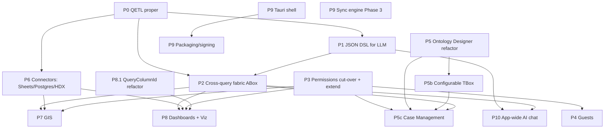

# Avandar Production Readiness Plan — World Humanitarian Day (2026-08-19)

Status: **DRAFT for approval.** Once approved, this document becomes the source
for a Linear **initiative** (this whole plan), **projects** (each product /
track below), and **tasks** (each numbered feature/refactor).

---

## 1. Context and North Star

On **August 19, 2026** we demo Avandar at World Humanitarian Day. The goal is a
platform a humanitarian organization can actually run on. Our recurring design
lens ("North Star") is **outbreak investigation and emergency response** -
Ebola and Cholera epidemics: case line-lists, contact tracing, facility and
supply tracking, field data collected offline, cross-referenced against open
humanitarian data, mapped, and dashboarded for coordination.

**Nothing below is hard-coded to cholera.** Cholera/Ebola is the worked example
we use to sanity-check that a feature helps a humanitarian org track "cases"
(entities) of any type. Everything must stay configurable and domain-agnostic.

### Description Logic reframing (naming convention used throughout)

We are adopting Description Logic (DL) theory and nomenclature **internally**
(engineering + config surfaces), not necessarily in end-user copy:

- **TBox** = the schema / "type" layer: entity types, their fields, allowed
  statuses, relations. Today this is `EntityConfig` + `EntityFieldConfig` +
  `ValueExtractor`.
- **ABox** = the instance / "data" layer: the actual cases/records. Today this
  is `Entity` + `EntityFieldValue`.
- **Ontology** = a coherent set of TBoxes + relations for a workspace/domain.
- **Ontology Designer** = the internal name for the reworked entity
  config/viewer product.

---

## 2. How to read this plan

- Each **Product** section lists: **Current state**, **Refactors**,
  **Features**, and **Depends on**.
- Tags on line items:
  - `[REFACTOR]` internal rework, little/no new user-facing surface.
  - `[NEW]` net-new capability.
  - `[FIX]` fixing an existing buggy/incomplete feature.
  - `[PARALLEL]` can proceed independently once its dependencies are met.
  - `[BLOCKS: X]` gates product/feature X.
- **Track 0 (Foundations)** is the shared substrate. Most product work depends
  on some part of it. Foundations are where the sequential bottlenecks live;
  the products themselves are largely parallel once their foundation piece
  lands.
- Section 12 has the **dependency graph, critical path, and the demo-critical
  subset for Aug 19**.

---

## 3. Timeline and scope decision

**Decision: full scope is committed for Aug 19.** All products and features
below are in scope for the demo; nothing is deferred to a post-demo roadmap.

**Honest risk note (recorded, not a blocker):** the full scope is realistically
**several engineering-months** and the demo is **~10 days out**. Delivering all
of it to production quality by Aug 19 is not achievable at normal staffing; this
plan assumes heavy parallelization across many owners/agents and accepts that
some items will land as demo-quality rather than fully hardened. Section 12.3
therefore keeps a **demo rehearsal priority order** - not a reduced scope, but
the sequence in which to make the North Star story
(offline case intake → map → dashboard → open-data cross-reference) demoable
first, so there is always a working end-to-end path to show.

---

## Track 0 - Foundations (shared substrate, mostly sequential bottlenecks)

These are the cross-cutting refactors that unblock the products. They are
listed first because their ordering drives the whole plan.

### P0. QETL Engine - proper OLAP + non-OLAP implementation
**Current state:** `src/clients/qetl/QETLClient.ts` is a self-labeled v0
prototype (Baldacci 2017 model) running DuckDB-WASM in the browser. It fetches
**whole datasets** only, has no real dicing/filtering/optimization, no cube
eviction, no cache-staleness detection, a naive substring-based dice detector,
`prepareFacts` is a no-op, and there is **no OLAP vs non-OLAP (transactional)
branching**. `google_sheets` extraction throws "not supported".

- P0.1 `[REFACTOR]` Replace substring `getDiceFromSql` with real SQL-AST dice
  detection (reuse `node-sql-parser` already in the DSL layer).
- P0.2 `[NEW]` Implement true **dicing**: predicate/column pushdown so only
  the needed slice of a dataset is extracted, not the whole file.
- P0.3 `[NEW]` Implement the **OLAP algorithm** (multidimensional fact prep,
  `prepareFacts`, aggregation-aware extraction) per the QETL paper.
- P0.4 `[NEW]` Implement the **non-OLAP / transactional algorithm** (point
  lookups, row-level reads) - evaluate SQLite-WASM transactional cube vs
  DuckDB, wire an OLAP/transactional flag on the client.
- P0.5 `[NEW]` **Cache-staleness / freshness**: dirty-flag + last-modified
  checks per dice so live sources (Sheets/Postgres) don't serve stale data.
- P0.6 `[NEW]` **Cube eviction / memory management** (MemoryCube LRU, storage
  cube budgeting).
- P0.7 `[REFACTOR]` Unify `WorkspaceQETLClient` / `PublicQETLClient` /
  entity-query paths onto the reworked engine; remove the "public querying is a
  stopgap" path.
- P0.8 `[NEW]` Live-source dice extractors (feeds P6 connectors): pluggable
  extractor interface for non-parquet sources.
- `[BLOCKS: P1 (partly), P2 cross-querying, P5 case-mgmt queries, P6 connectors, P3 dashboard perf]`

### P1. Query DSL - JSON-first, LLM-facing
**Current state:** A mature JSON DSL **already exists** -
`shared/models/queries/StructuredQuery` with a bidirectional bridge
(`structuredQueryToSql` via knex, `sqlToStructuredQuery` via node-sql-parser).
But the LLM path (`supabase/functions/chat`, offline WebLLM) emits **raw SQL**
via a `generateSql` tool, and `structuredQueryToSql` **throws on EntityConfig
sources**. So the "simplified JSON DSL for LLMs" is mostly *wiring the LLM to
the DSL we already have* + closing gaps.

- P1.1 `[REFACTOR]` Freeze and document `StructuredQuery` as the canonical,
  versioned JSON query contract (publish a JSON Schema for it).
- P1.2 `[NEW]` Add a `generateStructuredQuery` LLM tool (online chat edge fn +
  offline WebLLM) that emits **DSL JSON**, not raw SQL; validate against the
  schema and reject/repair invalid output.
- P1.3 `[NEW]` LLM accuracy harness: eval set of NL→DSL cases (cholera/Ebola
  flavored) to measure accuracy vs the old raw-SQL path.
- P1.4 `[FIX]` Make `structuredQueryToSql` support **EntityConfig (ABox)**
  sources (currently throws) - depends on P2.
- P1.5 `[REFACTOR]` Keep raw-SQL escape hatch ("sacrosanct" hand SQL) but make
  DSL the default produced/edited artifact.
- P1.6 `[NEW]` Extend DSL coverage flagged as `unmappedReasons` today where
  feasible (CTEs, UNION, window functions) or explicitly document the boundary.
- `[Depends on: P0 for execution; P2 for ABox querying]`

### P2. Cross-product query fabric (ABox as a first-class queryable source)
**Current state:** Entities are virtual; querying them routes through
`EntityFieldValueClient` (external-id union + per-dataset correlated
subqueries - the multi-dataset merge). DSL/DuckDB path **throws** for
EntityConfig. Entity queries don't yet apply group-by/aggregation/sort. This is
the "wire all products together for cross-querying" ask.

- P2.1 `[REFACTOR]` Formalize the ABox materialization as a QETL dice/source so
  an ABox can be referenced anywhere a dataset can (query explorer, dashboards,
  GIS, joins). **Preserve the existing multi-dataset merge semantics exactly.**
- P2.2 `[FIX]` Apply group-by, aggregation, sorting, filters to entity/ABox
  queries (today "returns all values").
- P2.3 `[NEW]` ABoxes selectable in Query Explorer data-source picker and
  addable to dashboards as a DataViz source.
- P2.4 `[NEW]` Cross-source joins: ABox ↔ dataset, ABox ↔ ABox, dataset ↔
  open-data, via the reworked QETL/DSL.
- P2.5 `[REFACTOR]` Migrate entity generation/hydration off the ad-hoc in-browser
  path onto the unified QETL engine; keep provenance (`EntityFieldValue.datasetId`,
  `SourceBadge`).
- `[Depends on: P0, P1; BLOCKS: dashboards-on-ABox, GIS-on-ABox, case-mgmt reporting]`

### P3. Permissions completion and extension
**Current state:** Granular per-app roles + `resource_shares` (Drive-style) are
designed and largely built (`ResourceShareClient`, `ShareResourceModal` merged
with tests). BUT: production still runs on legacy `user_roles.role =
admin|member`; RLS cut-over to the new model is flagged as a later phase;
`resource_type` enum is only `dashboard | dataset`; the spec's "Shared with me"
surface may not have shipped; **there is no guest tier**.

- P3.1 `[REFACTOR]` Complete the **RLS cut-over** from legacy `user_roles` to
  `role_groups`/`role_group_app_roles`/`resource_shares`; lock the
  `util__resource_effective_role` truth table with pgTAP/integration tests;
  retire legacy shim helpers.
- P3.2 `[NEW]` Extend `resource_type` to cover **GIS maps**, **ontology/TBox**,
  and **ABox/case** resources so those products can be shared/restricted.
- P3.3 `[FIX]` Verify/ship the **"Shared with me"** surface for share-only
  members lacking the parent-app role (per redesign spec).
- P3.4 `[NEW]` **Internal private dashboards**: make private/restricted the
  natural default path (today `is_restricted` exists but public `is_public` is a
  separate flag) - clean UX for "visible only to me / to a group" without going
  public. (Product-facing part continues in P8.)
- `[BLOCKS: P4 guests, P7 GIS permissions, P5 case-mgmt permissions, P8 private dashboards]`

### P4. Guest access tier (Notion-style guests)
**Current state:** Net-new. Every invitee today becomes a full workspace member
with a 4-app role matrix. No lightweight external-guest concept exists.

- P4.1 `[NEW]` Data model: a **guest** principal that is not a full member -
  scoped to specific shared resources (a dashboard, a case view), no app-wide
  roles.
- P4.2 `[NEW]` Guest invite flow (email → guest, distinct from
  `workspace_invites` member matrix); guest acceptance + auth.
- P4.3 `[NEW]` RLS + `resource_shares` support for guest principals
  (read/limited access to exactly the shared resource).
- P4.4 `[NEW]` Guest-scoped UI shell (they see only what's shared, no workspace
  nav/settings).
- P4.5 `[NEW]` Guest management surface (list, revoke) in workspace settings.
- `[Depends on: P3]`

### P5. Ontology Designer refactor (rename + DL model)
**Current state:** Clean config/instance split already exists
(`EntityDesignerApp` = config/TBox, `EntityManagerApp` = instances/ABox). Gaps
vs a real DL/ontology model: **no entity-to-entity relations (DL roles/object
properties)**, no class hierarchy/subsumption, `manual_entry` extractor
unimplemented, config delete doesn't cascade, generation is in-browser and
re-writes all rows (no incremental sync).

- P5.1 `[REFACTOR]` Rename internal domain to DL nomenclature (TBox/ABox/
  ontology/role) across models, clients, views, routes. **Decided: internal
  only** - keep user-facing copy approachable (cases, types, fields, statuses);
  DL terms do not appear in end-user UI. Ship as a mechanical, well-tested
  rename.
- P5.2 `[NEW]` **Relations / object properties**: entity-type → entity-type
  references (e.g. Case → Patient, Case → Facility, Contact → Case). Model,
  config UI, and materialization.
- P5.3 `[NEW]` Optional **class hierarchy / subsumption** (a TBox extends
  another) - or explicitly defer with rationale.
- P5.4 `[FIX]` Implement `manual_entry` value extractor end to end (currently
  throws; feature-flagged off) - required for case data typed by humans, not
  just merged from datasets.
- P5.5 `[FIX]` Cascade delete of an ontology/TBox to its ABox rows + field
  values.
- P5.6 `[REFACTOR]` Incremental entity generation (stop full re-upsert every
  sync) and move heavy generation off the main browser thread / onto QETL.
- P5.7 `[NEW]` Configurable **TBox** (see P5b below) - statuses, allowed
  values, relations are workspace-configurable.
- `[Depends on: touches P2/P0 for materialization; BLOCKS: P5b, P5c case-mgmt]`

### P5b. Configurable TBox (workspace-configurable schema)
**Current state:** `Entity.status` is a free `string` defaulted to `active`;
status options are hard-coded in a stub UI. Nothing configurable.

- P5b.1 `[NEW]` Configurable **status sets** per TBox (e.g. Suspected →
  Probable → Confirmed → Recovered/Deceased for a case; org can define their
  own).
- P5b.2 `[NEW]` Configurable enumerations / controlled vocabularies for fields.
- P5b.3 `[NEW]` Configurable relations (from P5.2) exposed in the designer.
- P5b.4 `[NEW]` LLM-assisted TBox authoring (see P5c.1).
- `[Depends on: P5]`

### P5c. Case Management product (evolve legacy ontology → configurable cases)
**Current state:** Case-management UI is **stubs with no backend**:
`ActivityBlock` (comments) calls `notifyNotImplemented`; `StatusPill` is a
hard-coded combobox with no persistence; `Entity.assignedTo` column exists with
no writer/UI. Greenfield.

- P5c.1 `[NEW]` **LLM-configurable case types**: describe a domain in natural
  language ("cholera outbreak investigation") → generate a TBox (fields,
  statuses, relations) the org can edit. Domain-agnostic.
- P5c.2 `[NEW]` **Comments / activity feed** on an ABox (model, table, client,
  wire the existing Tiptap editor). Includes @mentions.
- P5c.3 `[NEW]` **Assignment**: assign a case (ABox) to a user/user-group;
  persist `assignedTo`; "assigned to me" views.
- P5c.4 `[NEW]` **Status workflow**: set/track status from the configurable set
  (P5b.1); status change history.
- P5c.5 `[NEW]` **Activity/audit log** (status changes, assignments, edits).
- P5c.6 `[NEW]` ABox **list/grid view** with filtering by status/assignee
  (today there's only a virtualized navbar + single-entity detail).
- P5c.7 `[NEW]` Manual case creation + edit (uses P5.4 manual_entry).
- P5c.8 `[NEW]` Notifications for assignment/mention/status change (reuse email
  client / in-app).
- `[Depends on: P5, P5b, P3 (assignee = permission principal)]`

---

## Products (Tracks A–H) - built on the foundations above

### P6. Data Connectors (Sheets, Postgres, HDX / Open Data)
**Current state:** `google_sheets` source **exists and is code-complete but
disabled** in the UI ("under maintenance"), and QETL throws on it. **No
Postgres/direct-DB source type.** Open-data catalog is generic + Beta with
**only World Bank WDI**; **no HDX** integration (schema already fits HDX well).

- P6.1 `[FIX]` **Google Sheets**: re-enable, harden, and wire the
  `google_sheets` **QETL extractor** (currently throws) so a sheet tab = one
  live dataset; token refresh, resync, error states. (Follows
  `docs/adding-new-data-source-types.md`.)
- P6.2 `[NEW]` **Postgres direct connection**: new `postgres` source type
  (enum, `datasets__postgres` table, RPC, model, client, QETL extractor). A DB
  table = one dataset; secure connection storage, schema introspection, live
  vs snapshot read. (Full source-type checklist in the adding-source doc.)
- P6.3 `[NEW]` **HDX pipeline**: new pipeline under the existing
  `apps/pipeline-server` + `@avandar/ava-etl` rails ingesting Humanitarian Data
  Exchange datasets into the open-data catalog (`catalog_entries__open_data`).
  Reuses existing schema (external org/service/id, license, canonical URLs).
- P6.4 `[NEW]` Additional North-Star HDX sources as pipelines (admin
  boundaries, health facilities, population) as time allows.
- P6.5 `[REFACTOR]` Open-data catalog Beta → production (search, provenance,
  refresh cadence surfacing).
- `[Depends on: P0 (live-source extractors P0.8) for Sheets/Postgres; pipeline
  framework already exists for HDX]`

### P7. GIS Tool
**Current state:** MapLibre GL **point-plotting prototype**
(`src/components/GISApp`). Only `Point` geometry; **no choropleth / polygons /
lines / heatmaps / layers**; style picker hard-disabled; heavy `console.log`s;
no config persistence; standalone `/map` route with **no permission gate**; not
embeddable in dashboards; datasets only (not virtual/ABox sources).

- P7.1 `[FIX]` Production cleanup: remove debug logs, re-enable/repair style
  picker, error/empty states.
- P7.2 `[NEW]` **Choropleth** (admin-boundary polygons joined to data) - core
  humanitarian map type.
- P7.3 `[NEW]` **Polygon + line geometry** support (parse, render, bounds).
- P7.4 `[NEW]` **Multi-layer** maps (stack dataset/ABox/open-data layers;
  add/remove/reorder; per-layer symbology).
- P7.5 `[NEW]` Data-driven **color scales** (not just a single picker):
  categorical + graduated.
- P7.6 `[NEW]` **Persist** map configuration (a saved Map resource/model).
- P7.7 `[NEW]` **Embed a map in a dashboard** (Map PBlock) so maps join the
  filter/dashboard system.
- P7.8 `[NEW]` GIS sources beyond datasets: **ABox** and **open-data/HDX**
  layers (e.g. plot cases on admin boundaries) - depends on P2, P6.
- P7.9 `[NEW]` Wire **permissions** on maps (route guard + `resource_type` map,
  from P3.2).
- `[Depends on: P3.2 (perms), P2 (ABox layers), P6 (HDX layers); map rendering
  itself is PARALLEL]`

### P8. Dashboards and Visualizations
**Current state:** Puck-based editor (`AvaPage`, PBlocks, schema V4). Filters
and series settings exist **but are buggy** (detailed below). Public vs private
publishing exists (`is_public` + parquet copy to public bucket + slices).

#### Refactors (unblock the fixes)
- P8.1 `[REFACTOR]` **Query column identity**: introduce `QueryColumnId` and
  key viz axes/series and filters by column **id, not name string** (several
  open `TODO(jpsyx)` in `BarChart/LineChart` configs, `hydrateXY`, filters).
  This is the root cause of series silently vanishing and filter column
  mismatches. `[BLOCKS: P8.4, P8.5]`
- P8.2 `[REFACTOR]` Remove dead legacy `DashboardConfig`/`DashboardWidget`
  model (superseded by Puck `AvaPageData`).

#### Filters (fix the "there but very buggy")
- P8.3 `[FIX]` **Validated filter columns**: filter column must be picked from
  the query's actual output columns (dropdown), not free-text that errors at
  view time. Applies to both dashboard-level `Filter` PBlock and per-viz local
  filters.
- P8.4 `[FIX]` **Type-correct filter literals** (numeric/boolean/date columns
  no longer emitted as string literals relying on implicit casts).
- P8.5 `[FIX]` **Persist / stabilize local filter state** (today ephemeral
  `useState`, lost on Puck remount while global filters persist) - make local
  filters consistent with global.
- P8.6 `[FIX]` Correct `contains`/ILIKE escaping (`%`, `_`, backslash) and
  operator coverage.
- P8.7 `[FIX]` Enforce unique `filterId`; fix `selected`-subscription
  mount-timing bug so subscriptions resolve deterministically.
- P8.8 `[NEW]` Confirm/round out **both** filter scopes as a first-class
  feature: dashboard-level global filters **and** per-viz filters, documented
  and tested.

#### Series settings (fix the "non-buggy series settings")
- P8.9 `[FIX]` Stop **silently dropping** series/axes when a column key doesn't
  resolve after re-query (surface + let user remap). Depends on P8.1.
- P8.10 `[FIX]` **Stacked/percent** semantics (per-series `stackId` currently
  inert in Mantine stack/percent layouts).
- P8.11 `[FIX]` Allow non-numeric measures where valid; fix add-series
  enable/disable logic.
- P8.12 `[NEW]` Series settings parity across all viz types (bar/line/area/
  scatter/pie/funnel/radar/bubble) with consistent color/label/mark controls.

#### Dashboard features
- P8.13 `[NEW]` **Internal private dashboards** UX (product side of P3.4):
  create/share a dashboard visible only to me or a group, cleanly separate from
  "publish public". Uses `ShareResourceModal` + `is_restricted`.
- P8.14 `[NEW]` ABox/entity and open-data sources as DataViz inputs (from P2).
- P8.15 `[FIX]` Publishing hardening for new source types (Sheets/Postgres/ABox
  slices to public bucket).
- `[Depends on: P8.1 for P8.4/P8.5/P8.9; P2 for P8.14; P3 for P8.13]`

### P9. Desktop App (Electrobun → Tauri) + Offline Mode
**Current state:** Web offline (Dexie + duckdb-wasm) is **shipped**. Desktop is
Electrobun, **through Phase 2** (native layer works: `bun:sqlite`, native
DuckDB, keychain, filesystem blob store, full typed IPC, ~70 generated SQLite
migrations). **Phase 3 sync engine is NOT built** (only a TS interface); only a
one-way `SnapshotBootstrap` pull exists. Platform abstraction seam
(`shared/platform`) is clean and transport-agnostic. Tauri swap and the sync
engine are **independent workstreams**.

#### Tauri migration (shell + transport + packaging)
- P9.1 `[REFACTOR]` **Full Rust-native Tauri rewrite** (decided): reimplement
  the privileged services (`bun:sqlite` → `rusqlite`/`sqlx`, native DuckDB →
  `duckdb-rs`, keychain → Tauri `keyring`/stronghold, filesystem blob store →
  Rust `fs`) as Tauri Rust commands. Yields a single native binary with no Bun
  runtime dependency and de-risks the Windows/Bun blocker. Larger effort than a
  sidecar; the ~70 generated SQLite migrations and the transport-agnostic IPC
  `contracts/` still carry over.
- P9.2 `[REFACTOR]` Replace Electrobun IPC transport
  (`createElectrobunIpcTransport`, `desktopIpcBridgeScript`) with Tauri
  `invoke`/`emit`/`listen`; keep the transport-agnostic `contracts/`.
- P9.3 `[REFACTOR]` Port shell bootstrap: window/menu/lifecycle,
  `electrobun.config.ts` → `tauri.conf.json`, platform signal injection
  (`window.__AVA_PLATFORM__`, `isDesktop` detection).
- P9.4 `[NEW]` Tauri **packaging + signing/notarization** (macOS `.dmg`/`.app`,
  Apple Developer ID) + **auto-update** (Tauri updater). This is the strongest
  argument for Tauri (Electrobun signing is alpha).
- P9.5 `[NEW]` Windows target (`.msi`/`.exe`, WebView2) - Tauri de-risks the
  "Bun on Windows" blocker; likely post-demo.

#### Offline sync engine (Phase 3 - the crux of "fully working offline")
- P9.6 `[NEW]` Per-row sync columns + `sync_outbox` / `parquet_blob_outbox` /
  `sync_cursor` tables; **every data write + its outbox row in one SQLite
  transaction** (non-negotiable invariant).
- P9.7 `[NEW]` **Push loop** (local → Supabase) with resumable (TUS) parquet
  upload from the main process.
- P9.8 `[NEW]` **Pull loop** (Supabase → local) replacing the one-way
  `SnapshotBootstrap` stopgap.
- P9.9 `[NEW]` **Conflict resolution** (LWW baseline) + property-based tests
  (silent data loss is the failure mode).
- P9.10 `[NEW]` **Sync status UI** (pending/synced/error, manual retry).
- P9.11 `[NEW]` Implement the sync engine in **Rust** as Tauri commands
  (matching the P9.1 Rust-native decision); keep the outbox/pull-loop/LWW logic
  pure and property-tested since silent data loss is the failure mode.
- `[Tauri Rust shell (P9.1–P9.5) PARALLEL with sync engine (P9.6–P9.11); both
  only depend on the web build existing]`

### P10. App-Wide AI Chat and Chat Sessions
**Current state:** `ChatPanel` is already mounted app-wide in the layout, but
the assistant is **product-scoped**: `ChatPageContext.app` is one of
`data-explorer | data-sources | dashboards | other`, and its capabilities are
effectively a Data Explorer SQL copilot + dashboard-block generator (online via
`supabase/functions/chat` on OpenRouter; offline via in-browser WebLLM). There
is a **single persisted thread** (localStorage via `ChatPanelProvider`) - no
concept of multiple chat sessions, a "New chat" action, or chat history.

#### Refactors
- P10.1 `[REFACTOR]` Make the assistant **app-wide / product-agnostic**: turn
  page context into an optional hint, not a hard scope. One agent that can
  operate across any product (query any source, build dashboards, configure
  ontology/cases, add map layers, manage connectors) rather than a
  per-surface copilot. Broaden/replace the `ChatApp` context accordingly.
- P10.2 `[REFACTOR]` Route the assistant through the **JSON DSL tool** (P1) and
  the **cross-query fabric** (P2) so it can query datasets, ABoxes, and open
  data uniformly.

#### Features
- P10.3 `[NEW]` **Chat session model**: persist chat sessions/threads
  (server-side, workspace + user scoped) instead of a single localStorage
  thread; store message history.
- P10.4 `[NEW]` **Start new chat**: a "New chat" action that opens a fresh
  session while keeping the current one in history.
- P10.5 `[NEW]` **Chat history / session list**: list, resume, rename, and
  delete past chats.
- P10.6 `[NEW]` **Cross-product tool routing**: agent tools for query,
  dashboard, ontology/TBox, case, GIS, and connector actions; the tool surface
  grows as each product lands.
- P10.7 `[NEW]` Maintain **online + offline parity** (OpenRouter edge fn +
  WebLLM) for the app-wide agent and for sessions (offline sessions persisted
  locally and synced when online).
- P10.8 `[NEW]` **Permission-aware chat**: the agent can only read/act on
  resources the user can access (respects P3).
- `[Depends on: P1, P2 for full cross-product capability; the session model
  (P10.3–P10.5) is PARALLEL and can start now]`

---

## 12. Dependency graph, critical path, and demo scope

### 12.1 Dependency graph

### 12.2 Parallelization plan (tracks)

Independent tracks that can run **concurrently** with different owners:

- **Track A - Query core (critical path):** P0 → P1 → P2. Deepest, gates the
  most. Start immediately; sequence P0 before P1/P2.
- **Track B - Permissions & Access:** P3 → P4. Independent of Track A. Start
  immediately.
- **Track C - Ontology & Cases:** P5 → P5b → P5c. P5 (rename + relations) can
  start immediately; P5c needs Track B (P3) for assignment/permissions and
  Track A (P2) for reporting.
- **Track D - Dashboards & Viz:** P8.1 (QueryColumnId) + filter/series fixes can
  start immediately (independent of A); P8.14 (ABox sources) waits on P2.
- **Track E - GIS:** map rendering (P7.1–P7.6) parallel now; P7.8 waits on
  P2/P6; P7.9 waits on P3.2.
- **Track F - Connectors:** HDX pipeline (P6.3–P6.4) parallel now (framework
  exists); Sheets/Postgres extractors (P6.1–P6.2) wait on P0.8.
- **Track G - Desktop:** Tauri shell (P9.1–P9.5) and sync engine (P9.6–P9.11)
  are two parallel sub-tracks, both independent of A–F (only need the web
  build).
- **Track H - App-wide AI chat:** the session model + New-chat + history
  (P10.3–P10.5) can start immediately (independent of A); the app-wide/
  product-agnostic agent and cross-product tool routing (P10.1–P10.2, P10.6)
  ride on Track A (P1 DSL, P2 fabric) and grow as each product lands.

**Sequential bottlenecks (the real critical path):** `P0 → P1 → P2 → (P8.14 /
P7.8 / P5c reporting)`. Everything else parallelizes around it.

### 12.3 Demo rehearsal priority (sequencing within full scope)

Full scope is committed (Section 3), so nothing here is cut. This is the
**order** in which to land work so there is always a working end-to-end North
Star story to show - **configure a case type → collect/enter cases
(offline-capable) → map them → dashboard them → cross-reference open data** -
even if later, deeper items are still stabilizing on demo day. Land these first:

1. **Dashboards/filters/series usable (P8.1, P8.3, P8.4, P8.5, P8.9, P8.10)** -
   the buggy-filters/series complaints are the most visible; fixing them is
   high-leverage and mostly independent of the deep query rewrite.
2. **Internal private dashboards + basic sharing (P3.3, P3.4, P8.13)** - relies
   on already-built `resource_shares`; finish the UX and "shared with me".
3. **Guests, minimal (P4.1–P4.4)** - view-only guest to a single dashboard.
   High demo value ("invite a field partner to just this dashboard").
4. **Case management thin slice (P5c.1 lite, P5c.2, P5c.3, P5c.4 with P5b.1)** -
   comments + assignment + configurable statuses on entities, LLM-generated
   case type for the cholera example. Backend-wire the existing stubs.
5. **GIS points, cleaned up (P7.1) + plot cases/dataset on a map** - drop
   choropleth/multi-layer for the demo; a clean point map of cases is enough.
6. **Google Sheets re-enabled (P6.1)** - live field-data intake story; code is
   already mostly there.
7. **One HDX pipeline (P6.3)** - a single credible humanitarian open-data set
   in the catalog to cross-reference.
8. **Desktop:** get the Tauri Rust shell running online first (P9.1–P9.3,
   unsigned OK for the demo) so the app launches natively; the offline sync
   engine (P9.6–P9.11) and signing/Windows (P9.4/P9.5) continue in parallel and
   are the highest-risk items for the date - have the web/online path as the
   reliable fallback for the live demo.

**Nothing is cut** - the items above are the *first* to land, not the *only*
items. The highest-risk-for-the-date pieces (full QETL OLAP/non-OLAP rewrite
P0.3/P0.4, cross-query fabric P2, Postgres connector P6.2, choropleth/multi-
layer GIS P7.2–P7.8, Rust offline sync engine P9.6–P9.11) proceed concurrently;
if any is not demo-solid by the 19th, the North Star story still runs on the
priority items above.

### 12.4 Decisions (resolved)

1. **Scope commitment:** ✅ **Full scope** committed for Aug 19 (no post-demo
   deferral); Section 12.3 is a landing-order priority, not a cut list.
2. **Tauri shell strategy:** ✅ **Full Rust-native rewrite** (P9.1) - single
   native binary, de-risks Windows/Bun.
3. **Desktop for the demo:** ✅ Do the Tauri Rust migration now (in scope); web/
   online path is the live-demo fallback.
4. **DL nomenclature exposure:** ✅ **Internal only** (P5.1) - approachable
   user-facing copy.
5. **Class hierarchy/subsumption (P5.3):** ✅ **In scope** (full scope) - build
   now.

---

## 13. Proposed Linear structure

- **Initiative:** "Production Readiness - World Humanitarian Day 2026".
- **Projects (1 per product/track):** P0 QETL Engine, P1 Query DSL, P2
  Cross-Query Fabric, P3 Permissions, P4 Guests, P5 Ontology Designer, P5b
  Configurable TBox, P5c Case Management, P6 Data Connectors, P7 GIS, P8
  Dashboards & Viz, P9 Desktop/Tauri + Offline, P10 App-Wide AI Chat.
- **Tasks:** each numbered `Pn.m` item becomes a task, tagged
  `[NEW]/[FIX]/[REFACTOR]` and carrying its `Depends on` links.
- **Milestone/label:** tag the Section 12.3 items `demo-aug19` for a filtered
  view of the demo-critical path.
