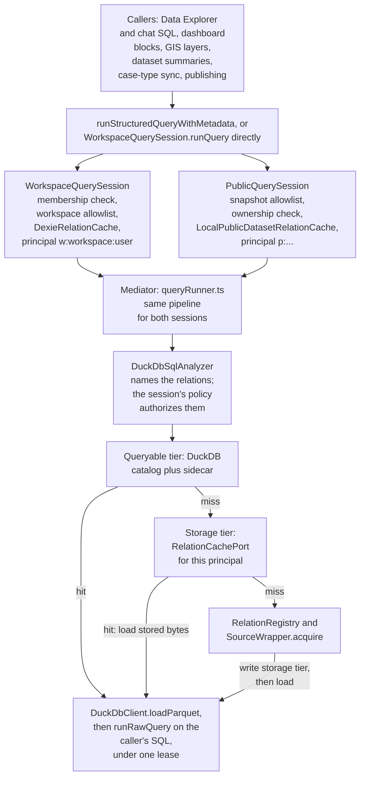
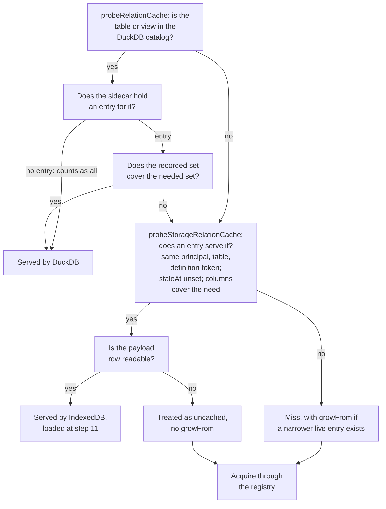
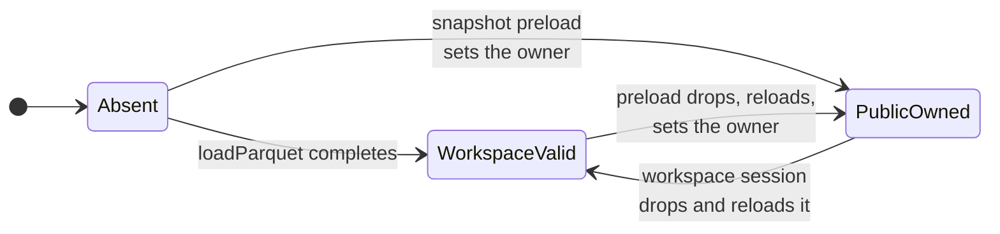
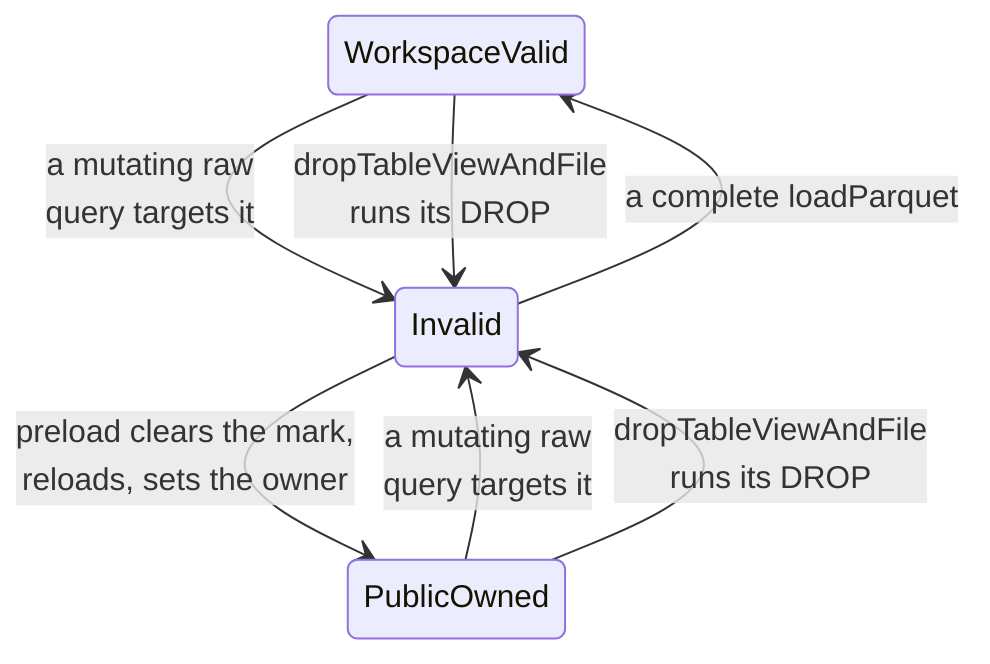
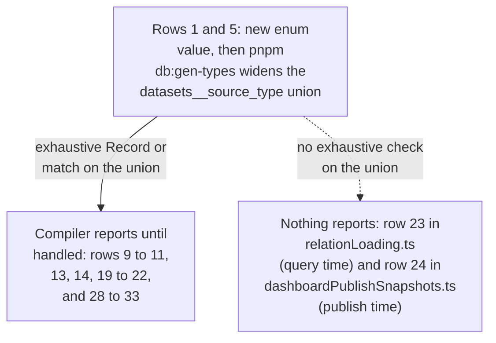

# QETL architecture

This is the reference for Avandar's in-browser query engine (QETL): what each
part does, which rules must hold, and how to extend it. It is written for
engineers and agents changing code under `src/clients/qetl/`,
`src/clients/DuckDbClient/`, `src/lib/sql/`, `shared/models/relations/`, or a
connector. When the code and this file disagree, fix one of them in the same
change. Facts are as of 2026-10-09 (`develop` at `af6e201ed`); section 13
lists the gaps known on that date.

## 1. What QETL is

QETL ("Query, Extract, Transform, Load") answers SQL inside the browser without
an upfront ETL step. When a query first names a relation, the engine fetches
that relation's rows from its source, converts them to Parquet, keeps a copy in
IndexedDB, and loads it into an in-browser DuckDB-WASM database where the
query runs. It is named after Baldacci et al.'s on-demand ETL paradigm, which
fetches facts from non-owned providers only when an OLAP query needs them and
reuses what was already loaded ([Baldacci et al., 2017](https://doi.org/10.1016/j.datak.2017.09.002)).

What QETL does today: for each relation a SQL statement names,
it makes sure that relation is a DuckDB table holding at least the columns the
statement needs, then runs the statement unchanged. It does not decompose
queries, push work down to sources, or plan by OLAP shape.

Every caller reaches it through one of two entry points:

- `runStructuredQueryWithMetadata`
  ([source](../src/clients/queries/runStructuredQuery/runStructuredQueryWithMetadata.ts)),
  used by the Data Explorer, chat-generated SQL, dashboard blocks, and GIS
  layers. It picks the session from an `auth` discriminant.
- `WorkspaceQuerySession.runQuery` called directly, used by dataset previews and
  summaries, case-type sync, GIS, and dashboard snapshot publishing.

Two chat helpers (`useDiscoveryResolver`, `tryExecuteOfflineSql`) call
`DuckDbClient.runRawQuery` directly and so bypass QETL's authorization and
loading entirely; they only see tables already resident in the tab.

## 2. Vocabulary

| Term | Meaning in code |
| --- | --- |
| relation | Anything SQL can name that QETL can make resident: a dataset or an ontology concept |
| `RelationRef` | `{ kind, id }` naming a relation; `kind` is `dataset` or `concept` ([RelationRef.types.ts](../shared/models/relations/RelationRef/RelationRef.types.ts)) |
| table name | A dataset's DuckDB name is its bare UUID; a concept's is `concept_<uuid>` (`RelationRef.toTableName` and `fromTableName`) |
| source type | `datasets.source_type`: `csv_file`, `xlsx_file`, `pdf_file`, `open_data`, `virtual`, `google_sheets`. Not part of `RelationRef` |
| session | `WorkspaceQuerySession` or `PublicQuerySession`; builds one mediator per principal with a policy object |
| mediator | The module built by `QueryMediatorFactory`; its only method is `runQuery`, implemented in `queryRunner.ts` |
| principal key | `w:<workspaceId>:<userId>` or `p:<bucket>:<dashboardId>:<percent-encoded revision>`; scopes the storage tier |
| wrapper | A `SourceWrapper`: adapts one kind of source to "give me this relation as Parquet" ([SourceWrapper.types.ts](../shared/models/relations/SourceWrapper/SourceWrapper.types.ts)) |
| capability | A `RelationCapabilities` record a wrapper declares (pushdown, freshness signal, row ceilings, quota). Declarative only today |
| registry | `RelationRegistry`: one wrapper per relation kind, built per fetch |
| acquire | `SourceWrapper.acquire`: fetch a relation's rows from its source |
| queryable tier | The DuckDB catalog itself: a dataset is cached if its table or view exists |
| sidecar | The module-level map in `queryableRelationColumns.ts` recording which columns each DuckDB table was loaded with |
| storage tier | IndexedDB behind `RelationCachePort`: `DexieRelationCache` (workspace) or `LocalPublicDatasetRelationCache` (public) |
| `growFrom` | On a storage miss, the narrower live entry for the same relation, whose columns are added to the next acquisition |
| lease | `DatasetDuckDbLease`: an unforgeable token proving the holder runs inside a coordinated operation for a set of names. No expiry |
| lease name | A dataset id or a concept spine table name that an operation must hold a lock for |
| owner | The published snapshot (`bucket`, `dashboardId`, `snapshotRevision`) recorded as owning a bare DuckDB table |
| invalid table | A table a mutation or a drop has touched; nobody may read it until a complete reload |
| poisoning | Marking a table invalid before a mutating statement runs |
| spine | `concept_<id>__individuals`: a one-column `VARCHAR` table of a concept's `external_id` values |
| `ava_rows_<id>` | A second view over a dataset's Parquet file that adds `file_row_number` |
| trusted internal SQL | SQL the DuckDB client or QETL builds itself (loaders, CSV sniffing, projection, concept views), marked with the `TRUSTED_INTERNAL_SQL` symbol so `runRawQuery` accepts it when the analyzer's only objection is a source it cannot inspect (`uninspectable-source`) |

## 3. Architecture: one query from caller to DuckDB



_Apart from the workspace session's per-call membership check, sessions differ
only in the policy object they hand the mediator; everything from the analyzer
down is shared code._

Related diagrams in this file: the probe order (section 6), table ownership
states (section 7), and connector touch points (section 10).

## 4. The thirteen steps of the per-query pipeline

All steps are called from
[`queryRunner.ts`](../src/clients/qetl/QueryMediator/queryRunner.ts); the links
point at the file that implements a step when it lives elsewhere. Steps 1 to 3
run before any lock; steps 4 to 13 run inside one coordinated operation.

1. **`getQueryDependencies`** (session policy). Workspace:
   `assertWorkspaceRelations` refuses any dataset outside the workspace. Public:
   intersects the SQL's references with the snapshot's dataset list.
2. **`planConceptRelations`** (workspace session only). Reads attributes,
   mappings, dataset columns, and individuals for each `concept_<uuid>` the SQL
   names; returns `[]` with no read when there is none
   ([getConceptRelationPlansFromSql.ts](../src/clients/qetl/QueryMediator/conceptRelation/getConceptRelationPlansFromSql/getConceptRelationPlansFromSql.ts)).
3. **`_getExpandedQueryDependencies`**. Adds each concept's contributing
   datasets, sorted and de-duplicated (`expandRelationRefs`).
4. **`runCoordinatedDatasetDuckDbOperation`**. Takes the lease on
   `getDuckDbLeaseDatasetIds` (workspace: every workspace dataset; public: every
   snapshot dataset) plus each planned spine name. A caller that already holds
   a lease only proves coverage
   ([DatasetDuckDbCoordinator.ts](../src/clients/DuckDbClient/DatasetDuckDbCoordinator/DatasetDuckDbCoordinator.ts)).
5. **`prepareDuckDbDatasets`** (session policy). Workspace: drop any table that
   a snapshot owns or that is invalid. Public: assert every table is owned by
   this snapshot.
6. **`_getNeededParquetColumnsForQuery`**. Infers needed columns
   (`getNeededColumnsFromQuery`), applies caller overrides
   (`neededColumnsByDatasetId`), and maps names to Parquet headers
   (`getParquetColumnNamesFromNeeded`).
7. **`probeRelationCache`**. Datasets DuckDB cannot serve: absent, or present
   with a sidecar set that does not cover the need
   ([getRelationSources.ts](../src/clients/qetl/QueryMediator/getRelationSources.ts)).
8. **`probeStorageRelationCache`**. Probes the session's port for the rest,
   reads hit payloads, and returns `growFrom` for misses
   ([relationLoading.ts](../src/clients/qetl/QueryMediator/relationLoading.ts)).
9. **`getRelationSources`**. Reads `datasets` rows and per-type source rows for
   uncached ids. Skipped when nothing is uncached.
10. **`fetchRelationBytes`** (`relationLoading.ts`). Builds a registry, then for
    each source in order calls `acquire` with the needed set plus `growFrom`,
    and, when that set is a finite column list, projects the result with
    `projectParquetBlob`. Sequential on purpose.
11. **`loadRelationBytes`** (`relationLoading.ts`). Writes new bytes to the
    storage tier (failures are logged and ignored), then `loadParquet` for every
    relation with renames limited to loaded columns, and records the sidecar.
12. **`loadConceptRelations`**. Builds each concept's spine, then its view.
13. **`DuckDbClient.runRawQuery`**. Re-analyzes the caller's SQL, proves the
    lease covers it, asserts workspace validity or snapshot ownership, poisons
    mutated tables, and executes; `returnType: "parquet"` exports through a
    temporary view and `COPY`.

A virtual dataset is acquired at step 10 by running its defining SQL through the
same `runQuery` with the outer lease (`runParquetQuery` in
`_createRegistryForFetch`). The nested query repeats steps 1 to 13 without
taking locks.

## 5. Components, their paths, and their dependencies

| Unit | Path | Responsibility | Depends on |
| --- | --- | --- | --- |
| Entry point | [`src/clients/queries/runStructuredQuery/`](../src/clients/queries/runStructuredQuery/) | Route raw or compiled SQL to a session by `auth` | sessions, `selectSqlToExecute` (in `src/views/`) |
| Workspace session | [`src/clients/qetl/WorkspaceQuerySession/`](../src/clients/qetl/WorkspaceQuerySession/) | Membership check per call; workspace policy; one mediator per workspace and user | authorization, analyzer, `DexieRelationCache`, CRUD clients |
| Public session | [`src/clients/qetl/PublicQuerySession/`](../src/clients/qetl/PublicQuerySession/) | Snapshot policy; one mediator per dashboard, visibility, revision | analyzer, `LocalPublicDatasetRelationCache`, `PublicDatasetParquetStorageClient` |
| Authorization | [`src/clients/qetl/assertWorkspaceMembership/`](../src/clients/qetl/assertWorkspaceMembership/), [`assertWorkspaceRelations/`](../src/clients/qetl/assertWorkspaceRelations/) | Principal check and per-relation check, both fail closed | `AuthClient`, `WorkspaceClient`, `DatasetClient` |
| Mediator | [`src/clients/qetl/QueryMediator/`](../src/clients/qetl/QueryMediator/) | The pipeline of section 4 | everything below |
| Column inference | `QueryMediator/getNeededColumnsFromQuery/`, `getParquetColumnNamesFromNeeded/`, `queryableRelationColumns/` | Infer and map needed columns; the sidecar | analyzer tokens |
| Concepts | `QueryMediator/conceptRelation/` | Plan, spine, view | ontology CRUD clients, `DuckDbClient` |
| Registry | [`src/clients/qetl/RelationRegistry/`](../src/clients/qetl/RelationRegistry/) | One wrapper per kind; registration checks | wrapper types |
| Wrappers | [`src/clients/qetl/wrappers/`](../src/clients/qetl/wrappers/) | `createDefaultRegistry` (dataset dispatcher on `sourceType`), Parquet, virtual, Sheets, concept wrappers | connector clients, CRUD clients |
| Cache adapters | [`src/clients/qetl/RelationCache/`](../src/clients/qetl/RelationCache/) | Workspace and public `RelationCachePort` implementations | `AvaDexie`, relation key helpers |
| Relation models | [`shared/models/relations/`](../shared/models/relations/) | `RelationRef`, capabilities, schema, wrapper types, cache key and port | none in `src/` (Deno-reachable) |
| SQL analyzer | [`src/lib/sql/DuckDbSqlAnalyzer/`](../src/lib/sql/DuckDbSqlAnalyzer/) | Fail-closed read, mutating, or unsafe verdict with the relations involved | `RelationRef`, `duckDbSqlText` |
| DuckDB client | [`src/clients/DuckDbClient/`](../src/clients/DuckDbClient/) | Facade over connection, load, query, export units; coordinator | analyzer, `@duckdb/duckdb-wasm` |
| Google Drive | [`src/clients/google/GoogleDriveClient/`](../src/clients/google/GoogleDriveClient/) | Tab CSV export, file version, debounced freshness | `fetch` |
| Open data (shared) | [`shared/open-data/`](../shared/open-data/) | CKAN client, resource selection, size-capped HTTP | runtime-neutral |
| Open data proxy | [`supabase/functions/open-data/`](../supabase/functions/open-data/) | Relays one catalogued CKAN resource | `shared/open-data` |
| Open data fetch | [`src/lib/openData/`](../src/lib/openData/) | Browser call to the proxy | Supabase session |
| Storage clients | [`src/clients/storage/`](../src/clients/storage/) | Workspace Parquet, catalog Parquet URL, snapshot generations | Supabase Storage |

The mediator imports the Supabase CRUD clients (`DatasetClient`,
`DatasetColumnClient`, per-type source clients) directly rather than receiving
them through the session policy, and the analyzer imports name helpers from
`src/clients/DuckDbClient/duckDbSqlText.ts` while `duckDbRawQuery` imports the
analyzer. Keep both facts in mind when moving these units.

## 6. Cache tiers, the storage key, and the two ports



_The cheaper tier is always asked first, and only a dataset both tiers decline
reaches a wrapper._

**Queryable tier.** Presence in `information_schema.tables` plus the sidecar.
It has no principal; it is protected by authorization (step 1), the lease check
(step 13), and ownership (section 7). A tab reload empties it.

**Storage key** ([RelationCacheKey.ts](../shared/models/relations/RelationCacheKey/RelationCacheKey.ts)):

| Part | Value | Compared at lookup |
| --- | --- | --- |
| principal | `w:...` or `p:...` | exact |
| table name | `RelationRef.toTableName(ref)` | exact |
| version token | `v0`, or `v1.` plus a truncated SHA-256 of `sourceVersion` | no, recorded only |
| definition token | `d0`, or `d1.` plus a truncated SHA-256 of kind and text | exact |
| columns | sorted, de-duplicated names, or `"all"` | coverage (`coversColumns`) |

The identity key is `principal|tableName|versionToken|definitionToken`. The
reuse predicate is `serves`. Column names compare case-sensitively.

**Ports.**

| | `DexieRelationCache` | `LocalPublicDatasetRelationCache` |
| --- | --- | --- |
| Tables | `RelationCacheEntry` (metadata), `RelationCachePayload` (blob) | `LocalPublicDataset` |
| Principals accepted | any, by key equality | public form only; parses and rejects `w:` |
| Columns | stored and compared; `growFrom` supported | ignored; every row served as `"all"` |
| `touch` | stamps `lastQueriedAt` | no-op |
| Eviction order | oldest `lastQueriedAt` | oldest `downloadedAt` |

Both ports evict only when IndexedDB raises `QuotaExceededError`: they evict
enough for the incoming payload, retry once, then throw
`RelationCacheWriteFailed`. The legacy `LocalDataset` table (imported Parquet
for offline use) has its own unrelated eviction.

## 7. DuckDB coordination rules

Every DuckDB load, drop, and raw or structured query in the app goes through
[`DatasetDuckDbCoordinator`](../src/clients/DuckDbClient/DatasetDuckDbCoordinator/DatasetDuckDbCoordinator.ts),
QETL or not. Catalog introspection (`getTableNames`, `getViewNames`) queries
`information_schema` directly.

- **Leases.** `loadParquet`, `loadCsv`, `loadXlsx`, `dropTableViewAndFile`,
  `runRawQuery`, and `runStructuredQuery` either take a fresh lease or check that
  a provided one covers every name they touch, and throw
  `DuckDB operation received an insufficient dataset lease` otherwise.
- **Two lock layers.** A promise queue per name inside the tab, then one Web
  Lock per name (`avandar:dataset-duckdb:<name>`) across tabs, requested in
  sorted order. Without the Web Locks API only the in-tab queue applies.
- **No re-locking.** A caller that holds a lease never requests locks again;
  Web Locks are not reentrant.
- **Ownership and validity.**



Where:

- **WorkspaceValid** - no owner recorded and not in the invalid set.
- **PublicOwned** - `loadedSnapshotOwnerByDatasetId` holds a bucket, dashboard
  and revision.

_A table leaves Absent through a load, and a table changes owner between the
workspace and a public snapshot only by being dropped and reloaded._



Where:

- **WorkspaceValid** - no owner recorded and not in the invalid set.
- **PublicOwned** - `loadedSnapshotOwnerByDatasetId` holds a bucket, dashboard
  and revision.
- **Invalid** - in `invalidDatasetTableIds`; a failed drop and a failed public
  preload load also land here.

_A workspace read is allowed only in WorkspaceValid, a public read only in
PublicOwned with the exact expected owner, and Invalid is readable by nobody._

- **Loading.** `loadParquetIntoDuckDb` drops the table, registers the blob as a
  `BROWSER_FILEREADER` file handle (byte-range reads, no copy into the WASM
  heap), and creates the dataset view plus its `ava_rows_<id>` view.
  `registerParquetFile` rejects a blob whose type is not
  `application/vnd.apache.parquet`.

## 8. Invariants and where each is enforced

Do not break these without changing the reason they exist.

| Invariant | Why | Enforced in |
| --- | --- | --- |
| Lock names are de-duplicated and sorted before Web Locks are requested | One global acquisition order prevents cross-tab deadlock (Havender's resource ordering) | `_runCoordinatedDatasetDuckDbOperation` in `DatasetDuckDbCoordinator.ts` |
| A held lease is never re-locked | Web Locks are not reentrant; a nested virtual-dataset query would deadlock itself | same function, `options.lease` branch |
| SQL the analyzer cannot fully account for is refused | Authorization uses the analyzer's reference list; a partial list would pass vacuously | `DuckDbSqlAnalyzer.ts`, `_getRawQueryExecutionPlan` in `duckDbRawQuery.ts` |
| `TRUSTED_INTERNAL_SQL` is set only on SQL the DuckDB client or QETL builds itself, and is ignored in public read mode | It is the only way past the analyzer's `uninspectable-source` refusal | `duckDbRawQuery.ts`, `duckDbClientOperations.ts` |
| Authorization (steps 1 and 2) runs before either cache probe | The DuckDB tier has no principal; a probe ahead of authorization could serve an unauthorized relation | `queryRunner.ts` step order; `probeStorageRelationCache` docstring |
| Storage entries are keyed by principal, and the public port rejects workspace principals | A public viewer and a workspace member must never share bytes | `RelationCacheKey.ts`, `LocalPublicDatasetRelationCache.ts` |
| Principal builders reject non-UUID ids and percent-encode the revision | Prevents two principals joining to one string through `:` | `makePrincipalKeyFrom*` in `RelationCacheKey.ts` |
| Mutated tables are marked invalid before the statement runs, and the mark is lifted only on the way to a complete reload (`loadParquet`, or the snapshot preload's clear, drop, reload, and `setPublicSnapshotDatasetOwner`) | A failed partial mutation must not leave a table that looks valid | `_prepareRawQueryDatasetTables` in `duckDbRawQuery.ts`, `_getParquetLoadResult` in `duckDbParquetLoad.ts`, `DatasetDuckDbCoordinator.ts`, `LocalPublicDatasetRawDataClient.ts` |
| Workspace reads reject public-owned and invalid tables; public reads require the expected owner | A public and a workspace view of one dataset id share one catalog | `assertWorkspaceDatasetTables`, `assertPublicSnapshotDatasetOwners` |
| Acquisitions in one query run sequentially | A virtual dataset's nested query loads tables the next acquisition may read | `fetchRelationBytes` in `relationLoading.ts` |
| Datasets load before concept views, spines before views | DuckDB binds a view's sources at `CREATE VIEW` time | `_runLeasedQuery`, `loadConceptRelations` |
| Column renames apply only to columns the loaded file holds | `SELECT * EXCLUDE (...)` fails on a projected-away column | `_isColumnInLoadedRelation` in `relationLoading.ts` |
| A dataset's table name is its bare UUID; every other kind has a prefix, tried longest first | Stored dashboard SQL, virtual dataset SQL, and `?sql=` URLs must keep resolving | `RelationRefModule.ts` |
| `RelationRef.fromTableName` must not resolve internal names (`concept_<id>__individuals`, `ava_rows_`, `ava_proj_`, `ava_staging_individuals_`) | A resolved name would be authorized and loaded as a relation; the analyzer instead maps `ava_rows_<id>` to a read of dataset `<id>` on purpose and treats staging tables as reading nothing | `RelationRefModule.ts`, `duckDbSqlText.ts`, `duckDbSqlSources.ts`, `loadConceptSpine.ts` |
| One wrapper per relation kind; declared pushdown or acquirability must have a method | Resolution must not depend on registration order; wiring errors surface when the registry is built, which is once per `fetchRelationBytes` call rather than at startup | `createRelationRegistry` |
| A spine's key column is `VARCHAR`, loaded through CSV, and empty ids are refused | Keys compare as text; user text must not enter SQL | `loadConceptSpine.ts` |

## 9. Design patterns in use, with a caveat for each

| Pattern | Where | Caveat |
| --- | --- | --- |
| Mediator-wrapper (Wiederhold) | `QueryMediatorFactory` plus `SourceWrapper` | The mediator never decomposes or plans; it only makes named relations resident |
| Adapter | each `SourceWrapper` | Default options reach for client singletons |
| Registry | `RelationRegistry` | Rebuilt per fetch; only the `dataset` kind is ever resolved |
| Runtime strategy selection | `_createDatasetWrapper` in `createDefaultRegistry.ts` | Documented as a "composite"; it dispatches on `sourceType`, it does not form a tree |
| Strategy (policy injection) | `QetlRunnerOptions` from each session | CRUD reads inside the pipeline are not injectable |
| Ports and adapters | `RelationCachePort` with Dexie, public, and in-memory test adapters | The port carries Dexie-shaped fields (`identityKey`, `touch`) |
| Cache-aside | steps 7, 8, 11 | No invalidation on source change |
| Facade | `DuckDbClient` over `duckDb*` units | The operation bundle is rebuilt per call so test doubles apply |
| Capability token | `DatasetDuckDbLease` | Called a lease, but has no expiry |
| Fail-safe defaults (Saltzer and Schroeder) | analyzer, `assertWorkspaceRelations` | The public session drops out-of-snapshot references at step 1 and relies on the step 13 lease check |

`SourceWrapper.describe`, `readFreshness`, `pushDown`, and the capability record
have no production caller beyond the registry's registration checks; treat them
as the vocabulary for a planner that does not exist yet.

## 10. Adding a new connector

Model a new connector as a new dataset **source type** (a `datasets` row plus a
`datasets__<type>` table), not as a new relation kind: the pipeline is typed
`Dataset.Id[]` end to end, and a new source type inherits column metadata,
sharing, the `datasets` RLS, and every dataset consumer (its own per-type table
and that table's RLS are row 2). Ordered checklist, using a
hypothetical `postgres_table` reached through a server-side proxy:

| # | File | Change | Caught by |
| --- | --- | --- | --- |
| 1 | `supabase/schemas/10.datasets.sql` | add the value to `datasets__source_type` | inherent |
| 2 | new `supabase/schemas/20.datasets__postgres_table.sql` | per-type table, RLS, grants | inherent |
| 3 | new `supabase/schemas/70.rpc_datasets__add_postgres_table_dataset.sql` | RPC calling `rpc_datasets__add_dataset` | inherent |
| 4 | `supabase/migrations/` | `pnpm db:new-migration` (after `ava supabase switch` on a branch) | generated |
| 5 | `shared/types/database.types.ts` | `pnpm db:gen-types`; widens the source-type union | generated |
| 6 | `apps/desktop/migrations/<stem>.gen.sql` | `pnpm desktop:sqlite:gen-migrations` | generated |
| 7 | `apps/desktop/sync/syncable-tables.ts` | add the table to `ACTIVE_TABLES` | the row 6 generator refuses to run until done |
| 8 | new `shared/models/datasets/PostgresTableDataset/` | model, parsers, namespace | inherent |
| 9 | `shared/models/datasets/DatasetSource/DatasetSource.types.ts` | registry entry | compiler |
| 10 | `shared/models/datasets/DatasetSource/DatasetSourceModule.ts` | `SourceTypes`, exhaustive match | compiler |
| 11 | `shared/models/datasets/DatasetSource/requiresOriginalFileRetention/requiresOriginalFileRetention.ts` | retention policy | compiler |
| 12 | new `src/clients/datasets/source-datasets/PostgresTableDatasetClient.ts` | CRUD client | inherent |
| 13 | `src/clients/datasets/SourceDatasetClient.ts` | registry entry | compiler |
| 14 | `src/clients/datasets/DatasetClient/createDatasetQueries.ts` | `getSourceDataset` arm | compiler |
| 15 | `src/clients/datasets/DatasetClient/createDatasetMutations.ts`, `DatasetClient.types.ts`, `DatasetClient.ts` | insert mutation and its registration | inherent |
| 16 | new server proxy, for example `supabase/functions/postgres-table/` | keeps credentials server-side | inherent |
| 17 | new browser client, for example `src/lib/postgresTable/` | calls the proxy, returns bytes | inherent |
| 18 | new `src/clients/qetl/wrappers/PostgresTableWrapper/` | `SourceWrapper` with `capabilities` and `acquire`, plus tests | inherent |
| 19 | `src/clients/qetl/QueryMediator/QueryMediator.types.ts` | `RelationSource` arm | compiler (through row 20) |
| 20 | `src/clients/qetl/QueryMediator/getRelationSources.ts` | reader function and `Record` entry | compiler |
| 21 | `src/clients/qetl/wrappers/createDefaultRegistry.ts` | options field, delegate, `match` arm, construction | compiler |
| 22 | `src/clients/qetl/wrappers/DatasetParquetWrapper/DatasetParquetWrapper.ts` | add the type to the refusing arm | compiler |
| 23 | `src/clients/qetl/QueryMediator/relationLoading.ts` | type guard, lookup, and registry option if the wrapper needs its source row; a lease-bound transcoder if it returns CSV or JSON | **nothing: fails at query time** |
| 24 | `src/clients/dashboards/DashboardClient/dashboardSnapshotHelpers/dashboardPublishSnapshots.ts` | branch in `_getSnapshotDatasetBlob`; the default downloads a Storage object that may not exist | **nothing: fails at publish time** |
| 25 | `src/views/DataManagerApp/DataImportView/` | connector card or tab and its view | inherent |
| 26 | `DatasetImportForm.types.ts`, `DatasetParseControls.tsx`, `useImportedColumns.ts` | metadata union and controls | inherent |
| 27 | `useSaveDataset.ts`, `makeDatasetImportedPayloadFromSaveResult.ts` | save branch, upload gating | inherent |
| 28 to 33 | `SourceBadge.tsx`, `DatasetSourceIcon.tsx`, `QueryDataSourceSelect.tsx`, `SavedDatasetsView.tsx`, `DatasetNavbar.tsx`, `DatasetMetaView.tsx` | label, icon, group title | compiler |
| 34 | `ResyncDatasetCard.tsx` | an arm only if the type is restored from a local file | inherent, situational |
| 35 | `src/i18n/locales/*/messages.po` | `pnpm i18n:extract` | generated |
| 36 | `getRelationSources.characterization.test.ts`, an e2e import spec | pin the reader and the flow | inherent |

Not needed: `Dataset/DatasetParsers.ts` (derives from `SourceTypes`), chat schema
code, `assertWorkspaceRelations`, and both cache ports, which are source-type
agnostic.



_After regenerating types, the compiler lists every guarded site; check rows 23
and 24 by hand, because nothing else will._

## 11. Adding a new relation kind

Only do this if the new thing cannot be a dataset row. The edge of the system
absorbs it: `RelationRef.types.ts`, `TABLE_NAME_PREFIX_BY_KIND` and
`toTableName` in `RelationRefModule.ts`, and `_PROBE_REF_BY_KIND` in
`RelationRegistry.ts` (all compiler-checked). Everything after that assumes
datasets and needs new branches: `IQueryMediator.getQueryDependencies`,
`_getExpandedQueryDependencies` (drops non-dataset refs),
`probeRelationCache`, `probeStorageRelationCache`, `_toDatasetCacheKey`,
`_readStorageCacheHit`, `getRelationSources`, `fetchRelationBytes`,
`loadRelationBytes`, `assertWorkspaceRelations`,
`LocalPublicDatasetRelationCache`, the analyzer's `UUID_REGEX` (ids must be
version 1 to 5 UUIDs), the ownership maps in `DatasetDuckDbCoordinator`, the
`QueryDataSource` union with `makeRelationRefFromQueryDataSource`, and the chat
helpers `SqlTableAlias` and `matchOfflineDatasetTable`.

## 12. Testing: commands and what each suite pins

**Executed tests** run real SQL in Node DuckDB (`@duckdb/node-api`) through
[`withDuckDb`](../src/lib/sql/__tests__/executedDuckDb.ts), which guarantees the
instance is closed. They match `**/*.executed.test.ts` and run under
`vitest.executed.config.ts` (Node environment, not jsdom):

```bash
pnpm test:executed
```

Everything else runs under the default jsdom project:

```bash
pnpm vitest run src/clients/qetl src/clients/DuckDbClient src/lib/sql src/clients/google/GoogleDriveClient src/clients/storage src/clients/queries shared/models/relations shared/open-data supabase/functions/open-data
```

| Behaviour | Pinned by |
| --- | --- |
| Storage probe precedes dataset reads; cached Sheets are not re-acquired | `QueryMediator/__tests__/relationCacheOrdering.test.ts` |
| Subset hits, wider misses, `growFrom`, `CREATE TABLE AS` overrides | `QueryMediator/__tests__/relationCacheProjection.test.ts` |
| Source-row reads per source type | `QueryMediator/__tests__/getRelationSources.characterization.test.ts` |
| Lease reuse for nested virtual queries | `QueryMediator/QueryMediator.coordination.test.ts` |
| Concepts load after their datasets | `QueryMediator/__tests__/QueryMediator.concepts.test.ts` |
| Column inference shapes | `getNeededColumnsFromQuery.test.ts` |
| Membership before every query; public-owned tables dropped first | `WorkspaceQuerySession.*.test.ts` |
| Snapshot allowlist, client cache, revision races | `PublicQuerySession/__tests__/*.test.ts` |
| Probe, supersede, evict, quota retry, principal refusal | `DexieRelationCache.test.ts`, `LocalPublicDatasetRelationCache.test.ts` |
| Lock order, nesting, release on throw, no-locks fallback | `DatasetDuckDbCoordinator.test.ts` |
| Leases across loads, poisoning, public versus workspace reads | `DuckDbClient/__tests__/*.test.ts` |
| Analyzer verdicts | `DuckDbSqlAnalyzer.test.ts` |
| Concept view grain and value pickers in real DuckDB | `src/lib/sql/__tests__/buildConceptViewSql.executed.test.ts`, `conceptAttributeColumns.executed.test.ts` |
| Sheets CSV read through a real DuckDB reader | `acquireGoogleSheetRelation.executed.test.ts` |
| CKAN resource selection and refusals | `shared/open-data/*.test.ts`, `statusFromOpenDataFailure.test.ts` |

Mediator tests use `createInMemoryRelationCache` instead of Dexie.
`projectParquetBlob.executed.test.ts` restates the projection SQL by hand and
does not call `projectParquetBlob`. No e2e test views a public dashboard while
signed out.

## 13. Known limitations and open gaps (as of 2026-10-09)

Status labels: **verified** means reproduced by running code; **by reading**
means traced through the source but not run.

| Gap | Status | Where |
| --- | --- | --- |
| No freshness: `sourceVersion` and `definition` are always `undefined` in the storage key, the acquired `sourceVersion` is dropped, `readFreshness` has no caller, nothing sets `staleAt`. Virtual dataset edits and CKAN republishes are never seen; only "Refresh from Google Sheets" evicts | by reading | `relationLoading.ts` |
| No pushdown and no capability-driven planning | by reading | `QueryMediator.ts` TODO |
| Eviction only on `QuotaExceededError`; no byte budget | by reading | both cache adapters |
| Every workspace query locks every workspace dataset, so top-level queries in one workspace serialize across tabs | by reading | `WorkspaceQuerySession.ts`, `queryRunner.ts` |
| Public sessions cannot plan or build concepts, so `concept_<uuid>` fails as a missing table unless a workspace query in the same tab left that view behind (step 13's public checks cover dataset relations only); they depend on the out-of-band preload in `useEnsurePublishedDashboardDatasets` and cannot acquire | by reading | `PublicQuerySession.ts`, `duckDbRawQuery.ts` |
| A nested virtual-dataset query that names a concept its outer query did not plan is refused for an insufficient lease | documented in code | `_getLeaseNames` in `queryRunner.ts` |
| Column inference attributes a table alias written without `AS` and a typed literal's keyword (`TIMESTAMP`, `DATE`, `INTERVAL`) as columns. When the dataset has a column the query does not name and no `"all"` copy is cached, the projection fails with a binder error, unless the keyword happens to equal a column name (`DATE` over a `date` column succeeds with a duplicate `date_1`) | verified | `getNeededColumnsFromQuery.ts`, `getParquetColumnNamesFromNeeded.ts` |
| In a multi-dataset statement that qualifies some names, unqualified names are not attributed, so the projection can drop a needed column | verified | `getNeededColumnsFromQuery.ts` |
| The analyzer refuses `EXTRACT(part FROM column)` as `uninspectable-source` | verified | `duckDbSqlSources.ts` |
| Anonymous public dashboards: `loadRelationBytes` always reads `dataset_columns`, which `anon` cannot read (HTTP 401 on the local stack) | 401 verified; dashboard failure by reading | `relationLoading.ts` |
| A CKAN resource in Parquet format is wrapped in an untyped Blob and fails `registerParquetFile` when the query needs all columns; the bad entry is cached first. Latent: in-repo registrations are CSV and XLSX | by reading | `DatasetParquetWrapper.ts` |
| The sidecar is never cleared; a stale narrow entry can make a public query reload a snapshot table and then fail the ownership check | by reading | `queryableRelationColumns.ts` |
| Snapshot publishing of an `all_columns` slice fails over Google Sheets (no Storage object exists) and over API-backed open data without a ready `LocalDataset` row (no `.parquet` canonical URL exists) | by reading | `dashboardPublishSnapshots.ts` |
| `_runConceptQuery` fallback ignores filters, grouping, aggregation, and sort | by reading | `runStructuredQueryWithMetadata.ts` |
| `ConceptWrapper` is registered but never resolved; `extractReferencedRelations`, `buildCsvFromDatastoreRecords`, `RelationRegistry.resolveAll` and `wrappers` have no production caller | by reading | as named |
| Concept attributes mapped from two datasets read only the first mapping | by reading | `makeConceptAttributeColumnsFromMetadata.ts` |
| An `ava_rows_` view outlives its dataset when the dataset is dropped and not reloaded | documented in code | `duckDbParquetLoad.ts` |
| Planned and absent: the 14-day offline authorization window, sorted materialization by entity key, publish-time concept materialization | by reading | design specs below |

## 14. Related documents

- Design specs, which describe intent rather than the code as built:
  [relation registry](superpowers/specs/2026-08-18-qetl-relation-registry-design.md),
  [relation cache](superpowers/specs/2026-08-18-qetl-relation-cache-design.md),
  [concept relations](superpowers/specs/2026-08-18-qetl-concept-relations-design.md),
  [Google Sheets](superpowers/specs/2026-08-18-qetl-google-sheets-design.md),
  [open data APIs](superpowers/specs/2026-08-19-qetl-open-data-apis-design.md),
  [column projection](superpowers/specs/2026-08-19-qetl-column-projection-design.md),
  and the [decisions log](superpowers/specs/2026-08-18-qetl-spec-decisions-log.md).
- [Adding a new dataset source type](adding-new-data-source-types.md) covers the
  non-QETL layers but is stale: it names eleven paths that no longer exist
  (including `src/clients/qetl/QetlClient.ts`,
  `src/clients/qetl/WorkspaceQetlClient.ts`,
  `src/clients/dashboards/DashboardClient.ts`, and `seed/SeedConfig.ts`),
  describes QETL as "Dice extractors", and omits rows 6, 7, 11, 16 to 23, 29,
  31 and 35 of section 10. Prefer section 10 for anything it covers.
- [Chat SQL table aliases](chat-sql-table-aliases.md) for how chat names
  relations in prompts.
- Patterns referenced: G. Wiederhold, "Mediators in the architecture of future
  information systems," *Computer*, 1992,
  https://doi.org/10.1109/2.121508; J. W. Havender, "Avoiding deadlock in
  multitasking systems," *IBM Systems Journal*, 1968,
  https://doi.org/10.1147/sj.72.0074; J. H. Saltzer and M. D. Schroeder, "The
  protection of information in computer systems," *Proc. IEEE*, 1975,
  https://doi.org/10.1109/PROC.1975.9939.
