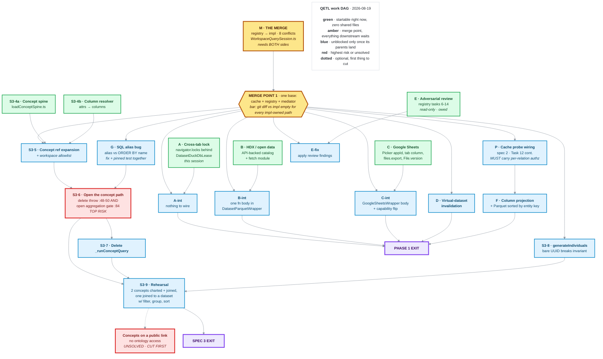

# QETL parallelization plan

**Written:** 2026-08-19, from `feat/qetl-impl` at `525396e0`.
**Supersedes** `.temp/qetl-impl/COORDINATION.md` sections 1 and 2 (who works
where, ownership). Its section 3 hard rules and section 6 findings still stand.

**Why this document exists.** `COORDINATION.md` describes a two-session world
with a fixed split. The goal now is different: keep as many worktrees busy as
possible, let each build against a frozen interface, and integrate in a separate
merge phase. This file is in the repo rather than in `.temp/` precisely so a new
worktree can read it from its own checkout.

**Note on paths.** `COORDINATION.md` and the two handoffs write absolute paths
under `/Users/pablo/...`. The real root is
`/Users/juanpablosarmiento/src/worktrees/avandar/`. Translate as you read.

---

## 1. Merge readiness: measured, not estimated

`REGISTRY_STATUS.md` reads `STATUS: READY_TO_MERGE_BACK`, and the registry
session released `QueryMediator/`, `WorkspaceQuerySession/` and
`PublicQuerySession/` to phase-1. The contract's own merge signal is set.

`git merge-tree --write-tree HEAD feat/qetl-registry` produces **8 conflicted
files** out of 67 changed on `feat/qetl-impl` and 86 on `feat/qetl-registry`.
That is a bounded merge, and every conflict is explained by the known cause:
`6943e1d8` swallowed a squashed, older copy of five phase-1 commits.

Verdict: **the branches are in a mergeable state**, and the merge should be its
own phase with a dedicated agent, because the hazard is silent rather than loud.

### 1.1 The eight conflicts and the rule for each

Seven of the eight resolve by taking one side wholesale. **One does not.**

| File | Resolution |
| --- | --- |
| `shared/models/relations/RelationCacheKey/RelationCacheKey.ts` | Take **impl** (229 lines vs 183) |
| `shared/models/relations/RelationCacheKey/RelationCacheKey.test.ts` | Take **impl** |
| `shared/models/relations/RelationCachePort/RelationCachePort.types.ts` | Take **impl** (113 lines vs 72; registry's predates the `probe()` reshape) |
| `src/clients/qetl/RelationCache/DexieRelationCache/DexieRelationCache.ts` | Take **impl** (396 lines vs 232) |
| `src/clients/qetl/RelationCache/DexieRelationCache/DexieRelationCache.test.ts` | Take **impl** |
| `src/views/GisApp/layers/useMapLayersData/useMapLayersData.ts` | Take **impl** (clustering work supersedes the cherry-picked `a4a7e210`) |
| `src/views/GisApp/layers/useMapLayersData/useMapLayersData.test.ts` | Take **impl** |
| `src/clients/qetl/WorkspaceQuerySession/WorkspaceQuerySession.ts` | **Combine both sides. See 1.2.** |

Plus one rename that git flags but does not conflict:
`src/clients/qetl/WorkspaceQetlClient/WorkspaceQetlClient.membership.test.ts`
was added on impl inside a directory the registry renamed. Move it to
`src/clients/qetl/WorkspaceQuerySession/` and rename it
`WorkspaceQuerySession.membership.test.ts` to match its subject.

`src/clients/qetl/QueryMediator/__tests__/getRelationSources.characterization.test.ts`
also conflicts. The impl side carries only `525396e0` ("formatted"), so take the
**registry** side (it holds the Task 13 rename) and then confirm no assertion or
test intent changed. Those 14 characterization tests are the cutover's
acceptance criteria; if one fails after the merge, that is a finding to report,
not a test to edit.

### 1.2 The one file that must not be resolved by picking a side

`WorkspaceQuerySession.ts` is where the two branches did genuinely different
things to the same function:

- **registry** renamed `WorkspaceQetlClient` to `WorkspaceQuerySession` and
  rewired `runQuery` through the registry.
- **impl** added the `assertWorkspaceMembership` call at the top of `runQuery`
  (commit `77c0ead3`), which is the only workspace membership check in the
  system.

Taking the registry side deletes an authorization check and produces a tree that
compiles, passes type-check, and is silently less secure. Taking the impl side
reverts the cutover. **Both must survive**: the renamed session, calling
`assertWorkspaceMembership` before any query work, keeping the verified
principal it returns so `runQuery` still makes one session read rather than two.

The membership test moved in the rename above is what proves this; it must be
green after the merge, not merely present.

### 1.3 Acceptance bar for the merge phase

Not "it compiles". A lost review fix shows up as a missing test, never as a
conflict.

1. For every path `feat/qetl-impl` owns (relation cache, `shared/models/relations/`,
   `dexieVersions`, `GisApp`, analytics, dashboards,
   `PublicDatasetParquetStorageClient`), `git diff feat/qetl-impl -- <path>`
   must be **empty**.
2. `WorkspaceQuerySession.ts` is the deliberate exception to rule 1, and its
   membership test must be green.
3. The relation cache suite count must not drop.
4. The full verification set below, all four commands.

```
pnpm test:frontend
pnpm test:executed
pnpm type-check
pnpm lint
```

`pnpm lint` is in the list because a previous session reported work green having
run only the first three, and had shipped a stylelint failure. Editor
diagnostics in this repo fire spuriously; confirm against `pnpm type-check`
before believing one.

---

## 2. What the frozen contracts unblock

This is the reason parallel work is possible at all.

**Frozen at the merge base `cf851570`, therefore byte-identical on both
branches, therefore safe to build against from either:**

```
shared/models/relations/RelationRef/            (kind + id, table-name mapping)
shared/models/relations/RelationCapabilities/   (capability declaration, SourceVersion)
shared/models/relations/RelationSchema/
shared/models/relations/SourceWrapper/          (SourceWrapper, WrapperContext,
                                                 AcquireRequest, PushDownRequest,
                                                 AcquiredRelation)
```

`SourceWrapper` is the load-bearing one. It is dependency-injected by
construction: `WrapperContext` carries only `workspaceId` and `logger`, and the
type file imports no client singleton. A wrapper "knows nothing about caching or
authorization" by its own docstring. **That means a new connector is buildable
and unit-testable in total isolation from the mediator, the registry, and the
cache.**

**On `feat/qetl-impl` only:** `RelationCachePort` (the reshaped `probe` port),
`RelationCacheKey`, `DexieRelationCache`, `LocalPublicDatasetRelationCache`,
`assertWorkspaceMembership`.

**On `feat/qetl-registry` only:** `RelationRegistry`, `createDefaultRegistry`,
`QueryMediator`, the renamed sessions, `DuckDbSqlAnalyzer` returning
`relations: RelationRef.T[]`, the `conceptRelation/` modules.

### 2.1 The integration seam every connector lane uses

A connector lane does **not** write a `SourceWrapper` and does **not** touch
`createDefaultRegistry`. Both live on the registry branch and would conflict.

Instead each connector lane delivers a **plain async module** with its own unit
tests: fetch, normalize, produce bytes plus a `SourceVersion`. The merge phase
wires it into the existing wrapper at exactly one call site. This keeps every
lane's diff disjoint from every other lane's, which is the whole point.

---

## 3. Lane map

Five lanes can start **immediately and concurrently**. Two must wait for the
merge.

| Lane | What | Base branch | Starts |
| --- | --- | --- | --- |
| **M** | The merge (section 1) | `feat/qetl-impl` | now |
| **A** | Cross-tab lock | `feat/qetl-impl` | now (in progress, this session) |
| **B** | HDX / open data API generalisation | `feat/qetl-impl` | now |
| **C** | Google Sheets connector | `feat/qetl-impl` | now |
| **E** | Adversarial review of the registry's 7 tasks | `feat/qetl-registry` | now (read-only) |
| **D** | Virtual-dataset invalidation | merged tree | after M |
| **F** | Column projection, entity-key-sorted Parquet | merged tree | after M |

### Lane A: cross-tab lock (this session, `feat/qetl-impl`)

Back the existing `DatasetDuckDbLease` with `navigator.locks`. **Do not
introduce a second locking mechanism beside it.**

- Single acquisition point: the fresh-lease branch of
  `_runCoordinatedDatasetDuckDbOperation`,
  `src/clients/DuckDbClient/DatasetDuckDbCoordinator/DatasetDuckDbCoordinator.ts:211-218`.
- **Callers do not change and the signature does not change.** The branded
  `DatasetDuckDbLease` means every site needing coordination already asks for it
  by type, which the compiler confirms.
- The `datasetIds` sort at line 196 becomes **load-bearing for cross-tab
  deadlock avoidance** rather than merely tidy. Say so in a comment.
- `navigator.locks` takes one name per request, so several requires folding over
  the sorted names.
- **Fallback required**: `navigator.locks` is absent in non-secure contexts and
  in the Node test environment. Degrade to the existing intra-tab queue rather
  than throwing.

**Conflict surface: none.** `DatasetDuckDbCoordinator.ts` is touched by neither
the registry branch nor any of the 8 conflicted files, so this lane merges
cleanly whenever it lands. `duckDbRawQuery.ts` *is* touched by the registry
branch, which is exactly why this lane must not edit it.

### Lane B: HDX / open data API generalisation (new worktree)

Generalize the open data catalog to API-backed entries and land HDX.

- **Owns:** the open data catalog model and a new HDX fetch/normalize module.
- **Must not touch:** `src/clients/qetl/wrappers/` (registry branch),
  `createDefaultRegistry`.
- **Seam:** `DatasetParquetWrapper` already claims `open_data` and downloads it
  via `_downloadOpenDataParquet` from the catalog entry's Parquet URL. This lane
  delivers the API-backed catalog resolution and fetch behind the same shape, so
  the merge phase changes one function body.
- **Done when:** an HDX resource resolves to bytes plus a `SourceVersion` in
  unit tests with a faked HTTP layer, with no dependency on QETL.

### Lane C: Google Sheets connector (new worktree)

- **Owns:** `useGooglePicker.ts` (`.setAppId()`), `VITE_GOOGLE_PICKER_APP_ID=323714789211`
  in `.env.development` and `.env.example`, the tab column on
  `shared/models/datasets/GoogleSheetsDataset/`, its migration, the Drive
  `files.export` to XLSX acquisition module, and `File.version` freshness with a
  debounced check plus an explicit-refresh menu item.
- **Must not touch:** `GoogleSheetsWrapper` (registry branch). That wrapper
  currently exposes an `acquire` that throws by design, because the registry
  validates at construction and rejects a declared capability without its
  backing method. The merge phase swaps its body to call this lane's module.
- `useGooglePicker.ts` is touched by neither branch, so that part is free.
- **Google Drive API is enabled and the Picker API is clean**; spec 4 has no
  console blockers left.
- **Run `ava supabase switch` first.** This lane carries a schema migration.
  Worktrees share one local Supabase project by default, but `ava supabase
  switch` starts an **isolated local Supabase project for the current branch**,
  which is exactly what makes migration work safe to run beside other lanes.
  Confirm with `ava supabase status`, validate with `ava supabase migrations
  validate`, and `ava supabase restore` when the lane closes. Schema work does
  **not** serialize the lanes.

### Lane E: adversarial review of the registry's seven tasks (read-only)

This is an **owed obligation**, recorded in both handoffs and never met. The
phase-1 tasks each went through implementer, spec-compliance and code-quality
review, and the quality stage found a real defect in **every one**. The
registry's tasks 6 to 14 have passing tests and no equivalent review. Green and
reviewed are different bars.

- Read-only, writes only a findings document. Zero conflict surface, so it can
  run against `feat/qetl-registry` at the same time as lane M merges it.
- Known starting points, already identified and not to be rediscovered:
  `createDefaultRegistry.test.ts`'s `expect(dataset?.acquire).toBeInstanceOf(Function)`
  restates the type system, which `docs/rules/testing.md` bans; and
  `getWrapperForRef`'s cast is justified by a comment rather than a proof.

### Lanes D and F: after the merge

**D, virtual-dataset invalidation**, touches the definition token that feeds
`RelationCacheKey`, which is one of the eight conflicted files. Starting it
before M lands buys a guaranteed rebase.

**F, column projection and entity-key-sorted Parquet**, needs both halves:
`AcquireRequest.columns` and the cache key's superset reuse rule are on impl,
the mediator that computes the needed column set is on registry. Genuinely
sequential.

---

## 4. Rules every lane inherits

1. **`probe` is reserved for `RelationCachePort`.** Nothing else may be a probe.
2. `docs/rules/typescript.md:272` and `:310` **ban naming a conversion or lookup
   `resolve...` or `_resolve...`**. Violated three times so far.
3. **Mutation-test every behavioural claim.** Break the implementation, watch the
   specific test go red, restore, confirm byte-identical, and report which
   mutation each test caught. Keep positive controls beside every negative
   assertion, or a `not.toHaveBeenCalled()` passes for the wrong reason. Put
   mutants **outside the repo**, in the session scratch directory.
4. **No destructive git in a worktree you do not own**: no `rm -rf`,
   `git clean`, `git checkout --`, `git stash`, `git reset --hard`. Both original
   sessions lost work to exactly these.
5. **No rebase, force-push or history rewriting** on `feat/qetl-impl` or
   `feat/qetl-registry`.
6. **If you find unexpected files, ask before deleting.**
7. Run all four verification commands before reporting anything done.

### 4.1 The rule that matters most, restated

**`authorize()` is not enough to wire the relation cache probe.**
`assertWorkspaceMembership` is a **principal-level** check: it asserts the caller
may act in the named workspace. It does **not** assert that every relation named
by the query belongs to that workspace. That per-relation work is done by
`getQueryDependencies` (formerly `getDiceFromSql`), which intersects the SQL's
table references with the named workspace's dataset ids.

A probe wired ahead of source dispatch **bypasses that check**, so the probe must
carry its own per-relation workspace check derived from the dataset record, not
from ambient state and not from the `workspaceId` argument.

The failure mode is the dangerous kind: a future session sees `authorize()` on
the path, concludes the seam is safe, and wires a probe that skips the only
per-relation check in the system. That is worse than an obviously unguarded
path, because it looks guarded.

---

## 5. Integration phase

Lanes A, B, C land on top of the merged tree from lane M. Because each lane's
diff is disjoint by construction (section 2.1), integration is expected to be
wiring rather than conflict resolution:

- B: one function body in `DatasetParquetWrapper`.
- C: one function body in `GoogleSheetsWrapper`, plus flipping its declared
  capability once `acquire` is real.
- A: nothing; it is already behind the lease type.

Then the integration tests: an HDX resource queried end to end, a Sheet imported
through the Picker on `drive.file` alone and queried after a reload, and a
cross-tab write serialised under the real lock.

---

## 6. The DAG

Rendered to `~/Downloads/qetl-dag.png` and `.svg`.


