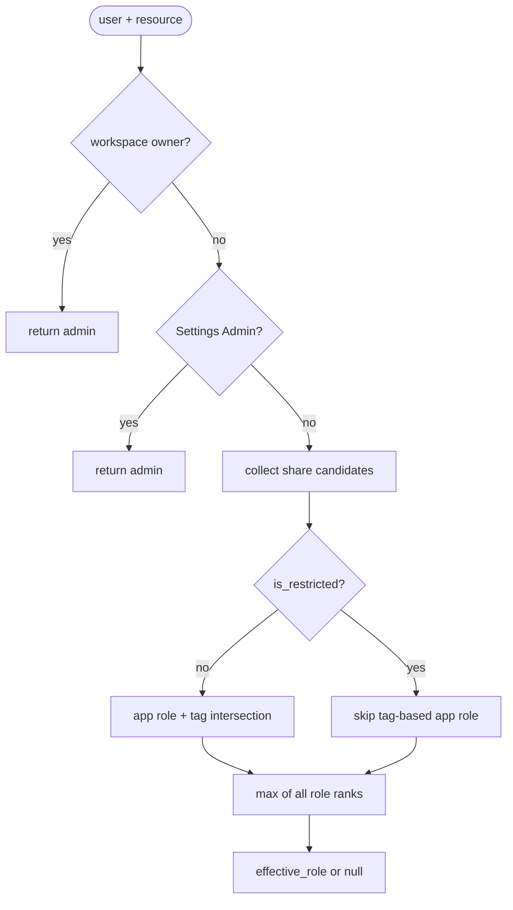
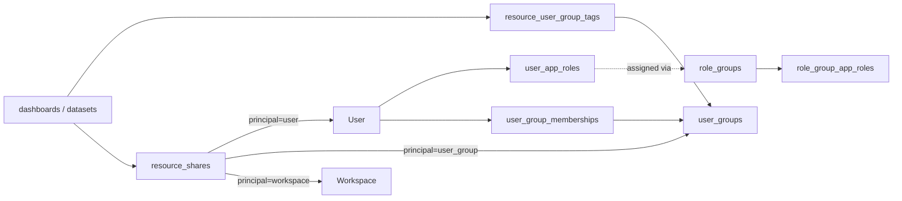
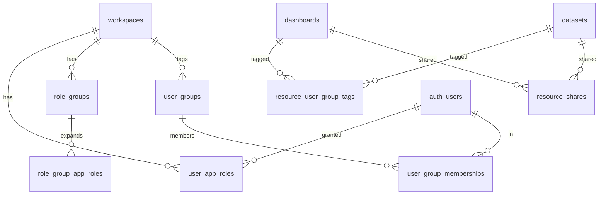

# Permissions architecture

This document is the canonical description of Avandar’s granular workspace
permissions model (per-app roles, role groups, user-group tags, resource shares,
and restriction). Humans and agents should treat it as the source of truth;
when implementation diverges, update the code **or** this file in the same PR.

**Related legacy state:** today production uses `public.user_roles.role` with
values `admin` | `member`. The migration below maps that to the new tables
without changing product semantics until RLS cut-over (later phase).

---

## 1. Goals

The system replaces a single workspace membership role with **per-application**
capabilities (`admin`, `editor`, `viewer`) across four apps, adds **role
groups** as named presets that expand into stored per-app rows, adds **user
groups** (tags) so resources and people can be labeled for intersection-based
access, and adds **per-resource shares** (user, user group, or whole workspace)
at a chosen role level. Resources may be marked **restricted**, which turns off
tag-based “default” access so only explicit shares (plus super-user paths) grant
access. **Workspace owners** and **Settings Admins** remain unconditional
admins for enforcement shortcuts. The experience is intentionally similar to
Google Drive-style sharing layered on top of workspace membership.

---

## 2. Vocabulary

**App (`app_type`)** — A product surface within a workspace whose access is
granted independently. v1 values: `data_sources`, `data_explorer`,
`dashboards`, `settings`. Example: a user can be `editor` in `dashboards` and
`viewer` in `data_sources`.

**Role level (`role_level`)** — One of `viewer` < `editor` < `admin`. Ordered
low→high in Postgres so enum comparison matches intent. Example: `editor` can
edit content that `viewer` can only read, per permission catalog rules.

**Permission key** — A derived string such as `data_sources__can_edit_dataset`;
the catalog maps `(app, role_level)` → keys. Admins do not toggle individual
keys; SQL enforces role levels, TypeScript gates UI via the catalog.

**Role group** — A named bundle of per-app role levels (`role_groups` +
`role_group_app_roles`). Built-ins include Global Admin / Editor / Viewer;
workspace admins may create custom groups. Example: “Analyst” =
`data_explorer: editor`, `dashboards: viewer`, others unset or defaulted per
product rules.

**User group (tag)** — A workspace-scoped label (`user_groups`) with
memberships (`user_group_memberships`). Resources link to tags via
`resource_user_group_tags`. Example: tag “Health” on people and datasets so
intersection gates access (see §4).

**Resource** — A row protected by RLS, typed as `resource_type` (`dashboard` |
`dataset` in v1). Carries optional tag rows and share rows; may set
`is_restricted`.

**Share** — A row in `resource_shares` granting a **principal** (single user,
user group, or entire workspace) a **role level** on one resource. Example:
share dashboard D to user U at `viewer`.

**Restriction (`is_restricted`)** — When `true` on a dashboard or dataset,
tag-based application of the user’s normal app role does **not** grant access;
explicit shares (and owner / Settings Admin paths) still do.

**Workspace owner** — `workspaces.owner_id`; always effective `admin`
everywhere in that workspace; cannot be revoked by shares or role edits.

**Settings Admin (Global Admin)** — A user whose `user_app_roles` row for
`settings` is `admin`; treated as `admin` across apps for enforcement shortcuts
in the resolution algorithm (see §4).

---

## 3. The “CSS specificity” mental model

Think of candidates contributing an effective role like CSS cascade layers—**all
qualified candidates are combined by `max(rank)`**, not “first match wins,”
except where a path **short-circuits** (owner, Settings Admin).

**Intuitive precedence (strongest signal first):**

1. Workspace owner → always `admin` (short-circuit).
2. Settings Admin → always `admin` (short-circuit).
3. Direct **user** share on the resource → strong grant; still merged with
   others via `max` (the “inline style” that almost always dominates).
4. **User group** share where the user is in that group.
5. **Workspace** share (everyone in the workspace gets at least that role).
6. If the resource is **not** restricted: **app role** for the resource’s app,
   gated by **tag intersection** (see §4 step 6).
7. Otherwise no grant from this path → contributes nothing (`null`).



---

## 4. Effective role resolution algorithm

This is the intended behavior for `util__resource_effective_role(p_resource_type,
p_resource_id)` (security definer, stable), called by RLS. Role ordering:
`admin (3) > editor (2) > viewer (1)`. Compute `effective_role := max(candidates)`.

1. If the user is **owner** of the workspace → `admin` (short-circuit).
2. If the user is **Settings Admin** (Global Admin) → `admin` (short-circuit).
3. If a **direct user** share exists for this resource → include its `role`.
   This row is the strongest share signal but is still combined with other
   candidates by `max`.
4. If a **user group** share exists for a group the user belongs to → include
   its `role`.
5. If a **workspace** share exists → include its `role`.
6. If the resource is **not** `is_restricted`, include the user’s
   `user_app_roles.role` for the resource’s **app**, **gated by tag
   intersection**:
   - If the resource has **zero** `resource_user_group_tags` rows → apply the
     app role (no tag filter).
   - Else apply the app role **only if** the user shares at least one
     `user_group` with the resource (non-empty intersection of tag ids).
7. If no candidate produced a role → `null` (no access).



---

## 5. Schema map

**Enums (planned)**

- `app_type`: `data_sources`, `data_explorer`, `dashboards`, `settings`
- `role_level`: `viewer`, `editor`, `admin` (ordered low→high)
- `resource_type`: `dashboard`, `dataset`
- `share_principal_type`: `user`, `user_group`, `workspace`

**Tables (planned)**

| Table                      | Purpose / keys                                                                                                    |
| -------------------------- | ----------------------------------------------------------------------------------------------------------------- |
| `user_app_roles`           | `(workspace_id, user_id, app)` unique; stores `role_level`.                                                       |
| `role_groups`              | `(workspace_id, name)` unique; `is_builtin` marks built-ins.                                                      |
| `role_group_app_roles`     | `(role_group_id, app)` unique; role per app for the group.                                                        |
| `user_groups`              | `(workspace_id, name)` unique; optional `color`.                                                                  |
| `user_group_memberships`   | `(user_group_id, user_id)` unique; tag membership.                                                                |
| `resource_user_group_tags` | `(workspace_id, resource_type, resource_id, user_group_id)`.                                                      |
| `resource_shares`          | `(resource_type, resource_id, principal_type, principal_id)` unique; `principal_id` NULL for workspace principal. |

**Column additions**

- `dashboards.is_restricted boolean not null default false`
- `datasets.is_restricted boolean not null default false`

**Legacy compatibility (migration period)**

- `user_roles` kept temporarily; may be maintained by trigger from
  `user_app_roles` until all readers migrate; dropped in a final phase.



---

## 6. TypeScript surface (planned locations)

| Area            | Location                     | Notes                                                                              |
| --------------- | ---------------------------- | ---------------------------------------------------------------------------------- |
| Catalog + types | `shared/models/Permissions/` | Frozen `Record<AppType, Record<RoleLevel, readonly PermissionKey[]>>`.             |
| Hooks           | `src/hooks/permissions/`     | e.g. `useUserAppRoles`, `useHasPermission`, `useResourceRole`, `useIsGlobalAdmin`. |
| Clients         | `src/clients/permissions/`   | e.g. `ResourceShareClient` for shares + tag edges.                                 |

**Example (UI gate)**

```typescript
// Conceptual; exact imports TBD when implemented.
const canEdit = useHasPermission("data_sources__can_edit_dataset");
```

---

## 7. UI surfaces (planned)

- **Workspace Settings → Tabs:** General, **Users**, **Roles**, **Tags**,
  Billing. Non-settings-admins see a 403-style state on this area.
- **Users tab:** Member table with avatar, name, role-group chip (or “Custom”),
  tag chips; row actions (edit drawer, remove).
- **User permissions drawer / invite:** **M × 3** `Radio.Card` grid — rows =
  apps, columns = Admin / Editor / Viewer (+ **None**). Top segmented control:
  Global Admin / Editor / Viewer / Custom syncs with rows; divergent rows force
  **Custom**. Tags via `MultiSelect`.
- **Roles tab:** Built-in role groups (read-only) + CRUD for custom groups using
  the same grid.
- **Tags tab:** CRUD for user groups; bulk-assign users to tags.
- **Share modal (`ShareResourceModal`):** Used from dashboard editor and dataset
  meta views; lists principals, role per share, workspace row, and **Restrict
  access** switch (`is_restricted`). Non-admins disabled via effective role
  hook.

---

## 8. Migration strategy

**Role mapping (one-off backfill)**

- Existing `user_roles.role = 'admin'` → insert **four** `user_app_roles` rows
  (`data_sources`, `data_explorer`, `dashboards`, `settings`), each `admin`.
- Existing `user_roles.role = 'member'` → insert **three** rows with
  `viewer` for `data_sources`, `data_explorer`, `dashboards` (**no** `settings`
  row — non-settings member).

**Built-in role groups**

- Seed per workspace: Global Admin, Global Editor, Global Viewer (`role_groups` +
  `role_group_app_roles`).

**Invites (`workspace_invites`)**

- Migrate from `role text` to `role_group_id uuid` plus JSONB `role_overrides`
  for per-app tweaks (exact shape finalized in invite phase).

**RLS cut-over**

- Introduce SQL helpers and new tables **before** switching policies; run pgTAP
  / integration tests side-by-side. Flip policies to
  `util__auth_user_can_access_resource` only after helpers match the truth
  table. Keep a temporary shim mapping legacy `util__get_auth_user_workspaces_by_role('admin'|'member')` to the new model until all call sites move.

**Reversibility**

- Schema migrations are forward-applied; rolling back production may require
  paired down migrations — prefer feature flags / phased deploy rather than
  silent data loss. Backfill uses idempotent upserts (`on conflict do nothing`
  where applicable) so re-runs are safe.

**Deprecation end state**

- Drop `user_roles` when no code path reads it; drop shim helpers last.

---

## 9. Common scenarios (“recipes”)

**Read-only access to one dashboard**

- Grant `viewer` on `dashboards` via role group or custom `user_app_roles`, **or**
  add a **user share** on that dashboard at `viewer`. Shares override narrow
  cases when combined via `max` with other grants.

**“Health” team edits Health datasets only**

- Create user group **Health**; tag Health members and Health datasets. Give the
  team at least `editor` on `data_sources` (or share specific datasets). Without
  overlapping tags on a dataset, app roles gated by tags do not apply.

**Dashboard visible only to me**

- Mark the dashboard **`is_restricted`**, remove workspace-wide overlap, and
  rely on **direct user share** (or owner access). Tags alone will not reopen
  access when restricted unless paired with explicit shares per §4.

**Whole workspace viewer on one resource**

- Add a **workspace** principal share at `viewer`; combine with stronger per-user
  or group shares via `max` as needed.

---

## 10. Anti-patterns / non-goals

- No per-column or per-field ACLs in v1.
- No cross-workspace resource sharing.
- **Public** dashboards (`is_public`) stay a separate flag in v1; not merged
  into `resource_shares` until a follow-up.
- No arbitrary SQL predicates inside shares — only typed principals and
  `role_level`.
- Role groups are presets, not runtime-evaluated formulas.

---

## 11. Glossary discovery commands

Run from repo root when touching permissions:

```bash
rg 'user_app_roles|role_groups|role_group_app_roles|user_groups|user_group_memberships|resource_user_group_tags|resource_shares|is_restricted' supabase/schemas shared src
rg 'util__(get_auth_user_app_role|get_auth_user_user_group_ids|resource_effective_role|auth_user_can_access_resource|is_settings_admin)' supabase/schemas
rg 'useHasPermission|useUserAppRoles|useResourceRole|useIsGlobalAdmin' src
rg 'ShareResourceModal|WorkspaceUserPermissions|workspace_invites' src
rg "WorkspaceRole|'admin'\\s*\\|\\s*'member'" shared/models src
```

---

## Document maintenance

- Update this file when schema names, algorithm steps, or UI contracts change.
- Phase 3 (RLS) and later phases should cite tests that lock the truth table
  for `util__resource_effective_role` and related policies.
